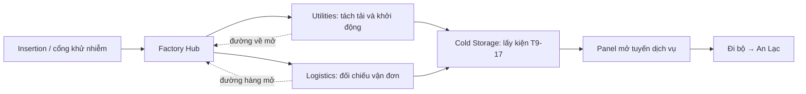
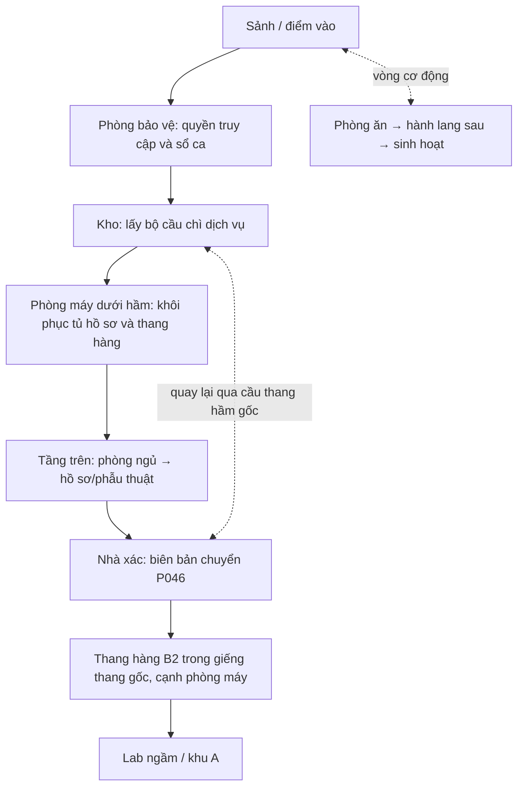
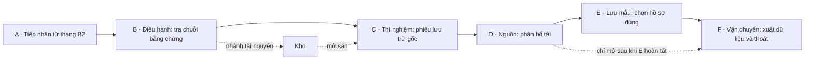

# OUTBREAK PROTOCOL — Cốt truyện, thao tác và giải đố cho chiến dịch ba map

**Bản thiết kế 1.0 · 06/09/2026 · Trạng thái: đề xuất nội dung để duyệt, chưa triển khai gameplay.**

**Thứ tự đã chốt theo yêu cầu: Nhà máy → Asylum → khu thí nghiệm nằm dưới Asylum.** Tên chương đề xuất: **Hồ sơ lạnh → Những người chưa rời viện → Tầng không có trên bản vẽ**.

Mục tiêu của bản này là đủ cụ thể để dựng objective, viết UI/thoại và làm prototype: người chơi đi đâu, nhìn thấy gì, bấm gì, suy luận thế nào, đáp án là gì, địch đến lúc nào, trạng thái nào được lưu và cách tránh kẹt tiến trình. Các thông số thời gian, khoảng cách tương tác, mật độ địch bên dưới là giá trị thiết kế ban đầu, chưa phải balance đã được playtest.

## Mục lục

1. [Căn cứ và phạm vi](#1-căn-cứ-và-phạm-vi)
2. [Cốt truyện xuyên suốt](#2-cốt-truyện-xuyên-suốt)
3. [Quy tắc thao tác và hợp tác](#3-quy-tắc-thao-tác-và-hợp-tác)
4. [Chương 1 — Nhà máy: Hồ sơ lạnh](#4-chương-1--nhà-máy-hồ-sơ-lạnh)
5. [Chương 2 — Asylum: Những người chưa rời viện](#5-chương-2--asylum-những-người-chưa-rời-viện)
6. [Chương 3 — Lab ngầm: Tầng không có trên bản vẽ](#6-chương-3--lab-ngầm-tầng-không-có-trên-bản-vẽ)
7. [Director, tài nguyên và nhịp độ](#7-director-tài-nguyên-và-nhịp-độ)
8. [Chuyển map, checkpoint và chống kẹt](#8-chuyển-map-checkpoint-và-chống-kẹt)
9. [Danh mục nội dung phải đặt trong map](#9-danh-mục-nội-dung-phải-đặt-trong-map)
10. [Kế hoạch triển khai và nghiệm thu](#10-kế-hoạch-triển-khai-và-nghiệm-thu)

## 1. Căn cứ và phạm vi

### 1.1 Ba scene được sử dụng

| Chương | Scene hiện có | Vai trò trong câu chuyện |
|---|---|---|
| 1 — Nhà máy | [GameScene.unity](E:/Unity/Project/FPS/Assets/FPS/Scenes/GameScene.unity) | Dấu vết sản xuất và vận chuyển T-9; giới thiệu thao tác và hai nhánh nhiệm vụ |
| 2 — Asylum | [AsylumFacility.unity](E:/Unity/Project/FPS/Assets/FPS/Features/World/Content/AsylumFacility/Scenes/AsylumFacility.unity) | Bệnh nhân và hồ sơ bị đổi danh tính; tìm lối xuống khu thử nghiệm |
| 3 — Lab ngầm | [ExperimentFacility.unity](E:/Unity/Project/FPS/Assets/FPS/Features/World/Content/ExperimentFacility/Scenes/ExperimentFacility.unity) | Đối chiếu toàn bộ bằng chứng, lấy hồ sơ gốc, thoát khỏi cơ sở |

`Show.unity` là nguồn của bản Asylum. Hai scene nguồn `AsylumFacility` và `ExperimentFacility` được giữ nguyên để authoring; nội dung được nhập vào **GameScene**. Asylum nằm phía bắc nhà máy; Lab nằm dưới Asylum, sàn chính Y = −18 m. Không load scene giữa các chương. Đi bộ qua đường dịch vụ tới Asylum; thang B2 chuyển vị trí cùng player object tới A và chờ client xác nhận trước khi mở cửa đích.

### 1.2 Dữ kiện đã xác minh và điều chưa thể kết luận

**Khảo sát trước tích hợp (lịch sử):**

- GDD yêu cầu co-op 4 người, hỗ trợ ít hơn 4; trọng tâm khan hiếm tài nguyên, kể chuyện qua môi trường và Director/Dynamic Difficulty hai tầng.
- GameScene đã có `FactoryMissionController`, 7 objective, 5 gate, các vùng Director, điểm recovery và rig trực thăng. Luồng source: `Insertion → BranchesActive → SampleUnlocked → SampleSecured → ExtractionActive → Completed`.
- Hai nhánh nhà máy hiện là gom đủ thao tác điện và vận đơn; chưa phải các câu đố mô tả trong bản này. Intro cấu hình 18 giây, finale 85 giây. Hiện hết giờ finale là hoàn thành; chưa thấy kiểm tra cả đội đã lên phương tiện trong nhánh xử lý đó.
- Hai map mới đã có kiến trúc, collider, NavMesh, ánh sáng và marker, nhưng chưa có mission controller, cửa tương tác hay nối mạng gameplay. Chỉ có marker không đồng nghĩa objective đã hoạt động.
- Asylum có tầng trên, tầng hầm, nhà xác, phòng máy và giếng thang máy gốc. Bản tích hợp dùng cầu thang hầm nguyên bản; gallery và cầu thang ngoài thêm trong bản trước đã bị gỡ theo phản hồi kiến trúc. Xuống Lab bằng thang B2, không thêm cầu thang xuyên các phòng.
- Lab có A–F, vòng kho B–C, hố được bảo vệ ở E, hành lang bảo trì D–F đang đóng tĩnh. Các cửa tuyến chính hiện mở.

**Giới hạn:** đợt thiết kế này không chạy trận co-op hay đo lại toàn bộ NavMesh nhà máy. Bounds nhà máy khoảng 432 × 416 m chứa cả ngoại vi; không coi tất cả tòa nhà trong bounds là nội thất đã đi vào được. Không suy ra thời lượng từ diện tích map. Các số kiểm tra môi trường của hai map mới là bằng chứng về môi trường, chưa chứng minh sức chứa horde hoặc tránh nhau giữa nhiều AI.

**Đề xuất mới:** tên viện, nhân vật, lô T9-17, bệnh nhân P046, mọi manh mối, câu đố, chuyển cảnh và ending. Đây không phải lore có sẵn trong project. Thứ tự ba map và việc Lab nằm dưới Asylum là yêu cầu đã chốt của người dùng.

### 1.3 Những điều chỉnh có chủ đích so với GDD/tài liệu map cũ

| Nội dung cũ | Thiết kế này | Lý do |
|---|---|---|
| Factory → Lab → trạm kiểm dịch ngoài trời là gợi ý | Factory → Asylum → Lab ngầm | Theo thứ tự người dùng chọn; nhà máy hiện có sân ngoài trời nên vẫn có tương phản với hai map trong nhà |
| Asylum kết thúc ở sảnh, lấy mẫu vật trong nhà xác | Asylum kết thúc bằng đi xuống B2; nhà xác cung cấp chứng từ chuyển người | Không lấy mẫu ba lần và không quay ngược về sảnh chỉ để kết thúc chương |
| Mỗi map có chờ cứu hộ 60–90 giây | Nhà máy mở tuyến dịch vụ 60 giây; Asylum gọi thang 35 giây; Lab xuất dữ liệu 90 giây | Ba cao trào có mục đích và nhịp khác nhau |
| Role chuyên biệt là gợi ý | Mọi người đều thao tác được; vai trò trong encounter do đội tự phân công | Không bắt có Medic/Recon để giải câu đố; chạy được với 1–4 người |
| GDD nhấn mạnh hợp tác bắt buộc và downed cần đồng đội | Giữ giá trị hợp tác với 2–4 người; solo được giải tuần tự, thất bại khi không còn khả năng tự phục hồi | Hỗ trợ ít người phải là chế độ chơi được; không yêu cầu đồng đội không tồn tại |
| Có thể điều chỉnh thời gian finale bằng độ khó | Timer đã công bố giữ ổn định; thích nghi chủ yếu qua áp lực địch | Tránh đồng hồ nhảy bất ngờ và dễ kiểm chứng Director |
| GDD không khuyến nghị tự hồi máu; chưa chốt chuyển chapter | Giữ HP, đạn và thuốc xuyên chương; tiếp tế hữu hạn | Duy trì hậu quả của quyết định tài nguyên xuyên chiến dịch |

Không thêm hộ tống NPC có AI, điều khiển xe, chế tạo thuốc, giải mã sinh học thật, boss mới hoặc cốt truyện rẽ thành nhiều campaign. T-9 là chất hư cấu; các bảng điều khiển là luật chơi, không mô phỏng quy trình phòng thí nghiệm thực.

### 1.4 Nguồn đối chiếu

- [basic_gdd.md](E:/Unity/Project/FPS/Documents/basic_gdd.md), đặc biệt mục 1–3, 5, 6, 8 và 9.
- [checklist.md](E:/Unity/Project/FPS/Documents/checklist.md): một số mục là lịch sử, không dùng nhãn TRUE/FALSE thay cho kiểm chứng hiện tại.
- [Khảo sát GameScene của đợt này](E:/Unity/Project/FPS/Documents/CampaignDesign/Evidence/GameScene-inspection.md).
- [Bàn giao Asylum](E:/Unity/Project/FPS/Documents/AsylumFacility/README.md) và [marker Asylum](E:/Unity/Project/FPS/Documents/AsylumFacility/markers.json).
- [Bàn giao Lab](E:/Unity/Project/FPS/Documents/ExperimentFacility/README.md), [sửa nội thất](E:/Unity/Project/FPS/Documents/ExperimentFacility/Review-02/README.md) và [marker Lab](E:/Unity/Project/FPS/Documents/ExperimentFacility/markers.json).

## 2. Cốt truyện xuyên suốt

### 2.1 Tiền đề

Sau vụ phong tỏa do T-9, một đội hợp đồng được thuê thu hồi **lô T9-17 và chứng từ vận chuyển** từ một nhà máy. Bên thuê gọi đây là chiến dịch **Cold Ledger / Hồ sơ lạnh**, khẳng định mẫu cần thiết để điều tra và cứu người. Đội có trang bị nhẹ, một trực thăng dân sự và sự hỗ trợ hạn chế từ xa.

**Vì sao đổ bộ ở nhà máy:** nhiệm vụ được giao ban đầu chỉ xác định kiện đối chứng tại kho lạnh nhà máy; địa chỉ An Lạc xuất hiện sau khi đối chiếu vận đơn. Sân bốc hàng là bãi đáp đã được trinh sát xác nhận, còn sân viện chưa được xác nhận an toàn. Phi công chỉ thực hiện lượt đổ bộ đã lên kế hoạch rồi rời khu phong tỏa, không chờ để chở đội giữa các tòa nhà. Đây là giới hạn của kế hoạch vận hành và thông tin ban đầu, không phải khẳng định trực thăng về mặt vật lý không thể đáp ở sân viện. Sau khi biết địa chỉ An Lạc, đội cần giữ kiện đối chứng và đi qua tuyến dịch vụ đã mở; việc đáp thẳng vào viện cũng không thay được nguồn và vật chứng cần thu hồi từ nhà máy.

Lý do này được nói bằng phụ đề trong intro và lưu trong journal. Khi xác minh vận đơn, radio nhắc lại rằng địa chỉ viện nằm ngoài lệnh thu hồi ban đầu và máy bay đã rời khu. Không thêm phòng không, sương độc hoặc trở ngại giả chưa có cơ chế/hình ảnh hỗ trợ.

Phạm vi thu hồi ở nhà máy là **kiện đối chứng còn giữ tại kho**, không phải lấy lại toàn bộ lô đã xuất đi. Sau chương 1, bên thuê mở rộng yêu cầu tới An Lạc để tìm bản bàn giao cuối và kiện lưu trữ tại nơi nhận. Điều phối đồng ý vì chứng từ cho thấy có người bị mắc kẹt; đội tiếp tục để xác minh và tìm người cần trợ giúp. Tại viện không tìm thấy người sống có thể tiếp cận, chỉ có dấu vết dẫn xuống B2. Vì vậy chương sau không biến thành nhiệm vụ hộ tống NPC chưa có trong phạm vi.

Hai case là hai vật khác nhau: **kiện đối chứng T9-17 của nhà máy** được đội mang qua Asylum và Lab; **kiện lưu trữ E-02 của Lab** được nhận riêng tại E. Hai cờ chung của đội được giữ tới ending, không chiếm slot thuốc/đạn. Dữ liệu gốc mới là thứ bên thuê muốn loại bỏ khỏi lần thu hồi cuối.

Nhà máy cho thấy T9-17 không chỉ phục vụ nghiên cứu: lô hàng được chuyển định kỳ tới **Viện điều dưỡng An Lạc**, nơi các bệnh nhân không có người bảo trợ biến mất khỏi hồ sơ xuất viện. Tại viện, đội phát hiện một số người bị khai là đã tử vong nhưng vẫn được chuyển xuống tầng B2. Lab dưới viện lưu toàn bộ thử nghiệm và bảng liên kết giữa lô hàng, mã bệnh nhân, kết quả theo dõi.

Mối đe dọa không phải bệnh tâm thần của bệnh nhân. Những người ở viện là nạn nhân của tổ chức sử dụng cơ sở điều trị làm vỏ bọc. Hiện trường phải thể hiện điều này bằng đồ dùng, hồ sơ và dấu vết chăm sóc bị gián đoạn; không dùng định kiến “bệnh nhân nguy hiểm” để giải thích infected.

### 2.2 Sự thật dành cho người viết kịch bản

1. T-9 được phát triển như một tác nhân điều trị thử nghiệm. Một nhóm quản lý tiếp tục thử trên người dù đã có cảnh báo nghiêm trọng; mục tiêu là giữ chương trình và giá trị thương mại, không có kế hoạch phát tán để hủy thế giới.
2. Nhà máy chịu trách nhiệm đóng gói và chuỗi vận chuyển. Khu Lab dưới viện thực hiện theo dõi bí mật trên nhóm bệnh nhân được chuyển xuống bằng thang hàng.
3. Bác sĩ **An**, người phụ trách theo dõi tại viện, giữ bản đối chiếu danh tính vì nghi ngờ số liệu bị sửa. Kỹ thuật viên **Lâm** để lại các ghi chú vận hành để nhân viên ca sau có thể tiếp tục cứu hộ.
4. Sự cố rò rỉ xảy ra khi việc phong tỏa bị trì hoãn và nhân viên vẫn phải vận chuyển người/hàng. Tài liệu cho thấy chuỗi quyết định sai; không cần mô tả thao tác phát tán tác nhân.
5. Người điều phối radio của đội chỉ biết hợp đồng ban đầu. Ở chương 3, bên thuê yêu cầu thu riêng mẫu và bỏ dữ liệu bệnh nhân, lộ mục đích che giấu trách nhiệm.
6. Đội mang được bằng chứng và một vật chứa niêm phong ra ngoài. Kết thúc mở về dịch bệnh: **chưa có thuốc chữa kỳ diệu**, nhưng sự thật không còn có thể bị xóa hoàn toàn.

### 2.3 Ba câu hỏi người chơi lần lượt trả lời

| Chương | Câu hỏi lúc vào | Bằng chứng buộc hiểu | Câu hỏi kéo sang chương sau |
|---|---|---|---|
| Nhà máy | T9-17 đang ở đâu, ai nhận nó? | Vận đơn AL-04, niêm phong K6, điểm nhận An Lạc | Vì sao một viện điều dưỡng nhận hàng nghiên cứu trong đợt phong tỏa? |
| Asylum | Chuyện gì xảy ra với những bệnh nhân đã “xuất viện”? | P046 có biên bản chuyển B2 sau thời điểm bị ghi là tử vong | Ai tiếp tục theo dõi họ bên dưới viện? |
| Lab | Ai sửa dữ liệu và dữ liệu gốc còn không? | Đối chiếu T9-17 → nhóm C12 → P046 → hồ sơ gốc E-02 | Đội có đưa được hồ sơ ra ngoài trước khi cơ sở mất quyền truy cập? |

Không giấu thông tin bắt buộc trong một audio log dài. Sau mỗi mốc, HUD cập nhật một câu và hồ sơ đội tự lưu phần liên quan. Người đọc thêm hiểu động cơ và con người; người bỏ qua lore vẫn hiểu việc cần làm.

### 2.4 Dòng thời gian của thế giới

| Mốc tương đối | Sự kiện | Dấu vết trong map |
|---|---|---|
| Vài tháng trước | An Lạc ký hợp đồng “theo dõi phục hồi” | Tờ thông báo dịch vụ mới, tên nhà tài trợ trên hồ sơ nhỏ |
| Một tuần trước | Nhóm C12 có phản ứng bất thường; bác sĩ xin dừng | Ghi chú y khoa ngắn bị gạch mục phê duyệt |
| Đêm trước sự cố | Lô T9-17, chuyến AL-04 được tiếp nhận lúc 02:40 | Vận đơn nhà máy, sổ bàn giao viện, log Lab thống nhất |
| Khi sự cố bắt đầu | Lối thoát bị khóa theo lệnh giữ tài sản; nhân viên cố cứu người | Chìa khóa để ở tủ trực, xe đẩy chắn một lối, đơn yêu cầu mở cửa chưa ký |
| Sau phong tỏa, trong khung 72 giờ của GDD | Đội vào nhà máy rồi được dẫn tới An Lạc | Briefing và radio; không có timer 72 giờ chạy suốt trận |

Thời gian 02:40 là dấu mốc giấy tờ, không phải yêu cầu người chơi chờ đồng hồ trong game tới đúng giờ. Ngày trên ba bộ tài liệu phải được tác giả đặt thống nhất, không lấy ngày máy tính người chơi.

### 2.5 Nhân vật và lượng thoại

| Nhân vật | Hiện diện | Chức năng |
|---|---|---|
| Đội hợp đồng | Player; không khóa câu chuyện theo một nhân vật chủ nhà | Tự quyết định cách chia việc; một giọng đại diện phát câu ngắn khi cần |
| Điều phối | Radio, phụ đề | Nối chương, nhắc mục tiêu, dần nghi ngờ bên thuê |
| Bác sĩ An | Giấy ghi chú, một log ngắn tùy chọn | Trả lại danh tính cho bệnh nhân, cung cấp bằng chứng |
| Kỹ thuật viên Lâm | Nhãn vận hành, sổ bàn giao | Manh mối thực dụng; không giải thích mọi câu đố hộ người chơi |
| Đại diện bên thuê | Hai lần radio ở chương 3 | Đưa yêu cầu đáng ngờ; tránh độc thoại phản diện dài |

Mỗi callout bắt buộc tối đa khoảng 1–2 câu, phát một lần cho cả đội, có phụ đề và xem lại. Không phát chồng lên cue của special infected. Cutscene chỉ ở đầu chiến dịch, chuyển địa điểm và kết thúc; không lấy quyền điều khiển giữa câu đố/giao tranh.

### 2.6 Thời lượng mục tiêu, chưa nghiệm thu

| Chương | Lần đầu, độ khó thường | Trọng tâm |
|---|---:|---|
| Nhà máy | 16–22 phút | Không gian rộng, hai nhánh, học tương tác |
| Asylum | 18–25 phút | Khám phá có chủ đích, đối chiếu hồ sơ, di chuyển liên tầng |
| Lab | 18–25 phút | Giải quyết các bằng chứng, kiểm soát hệ thống, thoát |
| Tổng | Khoảng 52–72 phút, chưa tính lobby/loading | Mốc để playtest, không phải lời hứa từ kích thước scene |

Nếu nhà máy quá dài, cắt đoạn chạy ngoại vi và nhánh loot trước khi cắt thông tin liên kết truyện. Nếu Asylum thành đi tìm từng phòng, tăng độ rõ của hồ sơ và chỉ dẫn; không thêm marker ở mọi cửa.

## 3. Quy tắc thao tác và hợp tác

### 3.1 Bộ thao tác dùng chung

| Thao tác | Input/hiển thị đề xuất | Quy tắc |
|---|---|---|
| Quan sát | Ngắm gần vật liên quan | Vật có nhãn đúng bối cảnh, phản hồi nhỏ ở tâm ngắm; không viền sáng xuyên tường |
| Dùng/nhặt | Nhấn **F**, theo prompt hiện có | Nhặt thẻ, lưu tài liệu, chọn một nút đã ngắm |
| Thao tác có thời gian | Giữ F 2–4 giây, thanh tiến độ | Dùng cho cần gạt, nối thiết bị, niêm phong; không phải mọi vật đều hold |
| Đọc chi tiết | F mở bảng; Esc đóng | Không pause thế giới; thông tin quan trọng tự vào hồ sơ chung |
| Hồ sơ đội | Phím **J đề xuất mới**, cho phép remap | Hiển thị manh mối, ảnh/nhãn và suy luận đã xác nhận; không tự giải đáp ngay |
| Đánh dấu | Dùng ping nếu đã có; nếu chưa, thêm ping đơn giản sau core | Hiện vật/địa điểm, không yêu cầu người chơi dùng voice chat |
| Giải bảng chọn | Trỏ và F xác nhận từng lựa chọn | Không dùng gõ mật khẩu dài hoặc kéo dây chính xác bằng chuột trong combat |

Phạm vi tương tác thiết kế: khoảng 2,5 m tới điểm thao tác, có line of sight. Đây là thay đổi so với nhà máy hiện đang cấu hình 4 m và tắt kiểm tra LOS. Cần căn interaction point, collider và camera trước khi bật điều kiện; không chỉ đổi con số rồi để người chơi đứng ngoài tầm.

Giữ F mà bị bắn/đánh, rời tầm, downed hoặc bấm bắn: hủy **thao tác đang giữ**. Các bước đã hoàn thành của cả câu đố vẫn giữ. Thả F trước khi đủ thời gian không tiêu vật phẩm. Không khóa người chơi đứng yên bằng animation dài sau khi thao tác đã bị hủy.

### 3.2 Phân công cho 1–4 người

- **4 người:** hai người có thể khảo sát/đối chiếu, một người thao tác, một người cảnh giới; trong nhà máy có thể chia 2–2 nhưng không bắt buộc.
- **2 người:** một người thao tác, một người giữ cửa; manh mối được lưu chung nên không cần chạy đưa giấy qua lại.
- **1 người:** mọi trạng thái gạt/chọn đều chốt lại; không yêu cầu giữ hai công tắc cùng lúc. Khoảng yên lúc đọc dài hơn, lượng địch giảm; logic và đáp án giữ nguyên.
- Không có câu đố yêu cầu đúng một class hay người cầm item ban đầu. Không dùng cơ chế “đứng trên bốn ô” chỉ để ép đủ người.
- Hai người cùng dùng một console: người được server chấp nhận trước giữ quyền thao tác ngắn; người còn lại xem được và nhận “Đồng đội đang thao tác”. Mất kết nối/ra xa tự nhả quyền, không khóa console vĩnh viễn.

Hợp tác đến từ che chắn, chia tài nguyên, cứu người và trao đổi thông tin. Lợi ích khi hai người làm song song là tiết kiệm thời gian, không phải điều kiện thắng.

### 3.3 Manh mối, đáp án và gợi ý

Mỗi map có tối đa **hai câu đố bắt buộc**; các bước còn lại là thao tác có mục đích hoặc chiến đấu. Phần chữ bắt buộc cho mỗi câu đố gói trong một bảng/phiếu ngắn, nhìn được ngay ở vị trí an toàn tương đối. Mọi clue thiết yếu được thêm vào hồ sơ chung khi một người kiểm tra.

Gợi ý chỉ đếm thời gian đội không tiến triển **khi đang ở gần câu đố và không trong giao tranh**:

| Thời gian chưa tiến triển | Gợi ý |
|---|---|
| 45 giây | Nêu quan hệ cần tìm: “Kiểm tra mã lô và niêm phong trên vận đơn.” |
| 90 giây | Chỉ vật cụ thể: “Phiếu trên bàn bên cạnh ghi chuyến của T9-17.” |
| 150 giây | Cho phép chọn “Xem hướng dẫn thao tác”; chỉ từng bước/đáp án | 

Không tự sinh thêm địch vì người chơi đang đọc chậm. Không reset puzzle khi Director đổi pha. Bấm sai phản hồi lý do, không gọi horde mới sau mỗi lần sai. Bản đầu dùng dữ kiện cố định; replay đến từ encounter và loot. Nếu random hóa dữ kiện ở bản sau, phải sinh đồng thời câu hỏi–clue–đáp án theo cùng một seed và kiểm chứng chỉ có một nghiệm.

### 3.4 Vật phẩm nhiệm vụ và vật phẩm sinh tồn

- **Hồ sơ, thẻ, cầu chì nhiệm vụ:** lưu trong trạng thái chung của đội; biểu tượng mang theo phục vụ trình bày. Không chiếm slot thuốc/đạn trong bản đầu. Đây là điều chỉnh có chủ đích từ gợi ý inventory RE trong GDD để tránh mất tiến trình khi người cầm chết hoặc disconnect.
- **Vật chứa niêm phong:** là objective chung sau khi xác nhận thu hồi. Có thể hiện một case nhỏ ở ba lô người nhận nhưng không yêu cầu mang hai tay, không khóa súng, không có countdown hỏng mẫu.
- **Thuốc và đạn:** vẫn là tài nguyên hữu hạn theo từng player; không biến thành kho vô hạn chung. Hệ thống drop/share sinh tồn không được giả định đã có.
- Mô hình nhiệm vụ rơi khỏi map không xóa flag đã nhận. Nếu cần nhặt vật lý trước khi flag được commit, recovery trả nó về giá đỡ đã biết; không spawn thêm bản sao có thể nhận lần hai.

### 3.5 Luật rời khu vực

Không đóng cửa phía sau một người chỉ vì người khác bấm terminal. Cửa được mở để tiến trình thuận lợi, các đường vòng đã mở giữ nguyên. Chỉ đóng buồng chuyển khu khi toàn bộ người chơi đang sống, còn kết nối và có quyền tham gia đã vào vùng chuyển; phải hồi sinh người downed trước. Trường hợp kết nối và retry xem mục 8.

## 4. Chương 1 — Nhà máy: Hồ sơ lạnh

### 4.1 Mục tiêu và tuyến đường

**Nhiệm vụ hiển thị đầu chương:** “Thu hồi lô T9-17 và chứng từ vận chuyển. Mở tuyến dịch vụ phía bắc để tới viện An Lạc.”

Tận dụng objective đang có trong GameScene. Không yêu cầu đi vào tất cả các nhà kho mới ở ngoại vi; tuyến bắt buộc chạy qua các cụm objective hiện đặt, các khối nhà còn lại tạo hướng nhìn và nhánh tài nguyên được lựa chọn.

Kho lạnh chỉ cho lấy kiện khi **Điện sẵn sàng AND Chứng từ hợp lệ**. Hai nhánh U/L giải trước sau tùy đội. Director gộp các yêu cầu cao trào nếu hai nhánh vừa hoàn thành gần nhau; không gọi hai horde chồng lên nhau.

### 4.2 Các mốc theo không gian hiện có

| ID thiết kế | Vị trí/binding hiện có | Thao tác và kết quả | Nhịp |
|---|---|---|---|
| F00 | InsertionSpawn quanh (−90, .15, −137); Gate_DeconExit | Intro 18 giây, cổng mở; kiểm tra radio, đọc HUD và nhặt một tài nguyên hướng dẫn | 30–45 giây đầu không tạo horde mới |
| F01 | Z02_FactoryHub | Thấy bảng nhỏ chỉ Logistics/Utilities/Cold Storage; hiện hai mục tiêu cùng lúc | Nhóm địch thường ngắn, cho học đường vòng |
| F02 | Ba OBJ_Utilities… | Giải P-F1; mở Gate_UtilitiesServiceReturn | Tiếng máy tạo một beat sau khi hoàn thành |
| F03 | OBJ_LogisticsManifest + SecurityOverride | Giải P-F2; lưu nơi nhận An Lạc; mở Gate_LogisticsCargoReturn | Một beat khi hoàn tất nhánh, không khi đọc mỗi tờ giấy |
| F04 | OBJ_ColdStorageSample, khoảng (118.6, 1.1, 58) | Kiểm tra tem, nhấn F thu hồi case; nhận bản bàn giao có chữ B2 | Báo động 28 giây là mốc hiện có để chỉnh nhịp |
| F05 | Gate_ExtractionEmergencyCorridor → OBJ_ExtractionRadio (112, .8, 105) | Giữ F mở tuyến dịch vụ; kiểm tra liên động 60 giây | Encounter tại khu điều khiển |
| F06 | Interlock trên đường dịch vụ phía bắc | Cổng mở; đủ đội trong vùng đệm 5 giây mới khép cổng sau và mở cổng trước | Đi bộ sang Asylum, chốt CP-A0 |

Tọa độ là mốc authoring hiện tại, không phải vị trí chân người chơi. Hai object có tên BreakerWest/East nằm không tương ứng trực giác phương hướng; giao diện puzzle sẽ dùng nhãn chức năng tải để tránh chỉ sai hướng.

### 4.3 P-F1 — Chuyển sang nguồn dự phòng

**Dạng:** câu đố quy trình nhẹ, dạy thao tác và phản hồi trạng thái. **Mục tiêu hiểu:** máy phát không thể vừa cấp dây chuyền vừa bảo đảm kho lạnh khi nhà máy đang lỗi. **Thời gian dự kiến:** 1–2 phút, không tính combat.

**Bối cảnh và props:** tận dụng hai breaker và generator. Thêm ba nhãn nhỏ bắt vào vỏ tủ, một phiếu vận hành cạnh generator và ba đèn trạng thái trên panel. Đây là bảng của thiết bị, không phải biển đen độc lập đứng giữa sân.

**Phiếu bắt buộc, nguyên văn:**

> CHẾ ĐỘ KHÔI PHỤC KHO LẠNH  
> 1. Tách nhánh DÂY CHUYỀN.  
> 2. Chuyển nhánh KHO LẠNH sang DỰ PHÒNG.  
> 3. Khởi động bộ nguồn. Giữ nguyên nhánh an toàn.

**Trạng thái đầu:** nhánh dây chuyền đang nối; nhánh kho lạnh chưa ở dự phòng; generator dừng. Đây là bộ luật của thiết bị hư cấu trong game.

| Bước | Người chơi làm | Phản hồi | Flag chỉ commit khi |
|---|---|---|---|
| 1 | Ở OBJ_UtilitiesBreakerWest, giữ F 2 giây “Tách dây chuyền” | Tay gạt đổi vị trí; nhãn hiện “Đã tách”; tiếng máy dây chuyền tắt | Hold hoàn tất, actor còn hợp lệ |
| 2 | Ở OBJ_UtilitiesBreakerEast, giữ F 2 giây “Cấp dự phòng kho lạnh” | Đèn KHO sáng, label “Sẵn sàng” | Bước 1 đã chốt |
| 3 | Ở OBJ_UtilitiesGenerator, giữ F 3 giây “Khởi động” | Máy chạy, panel hiện 3 trạng thái đã hoàn thành; đường về mở | Bước 1 và 2 đều đạt |

**Đáp án:** tách DÂY CHUYỀN → đặt KHO LẠNH vào DỰ PHÒNG → KHỞI ĐỘNG.

- Bấm generator sớm: “Chưa tách tải dây chuyền” hoặc “Kho lạnh chưa ở nguồn dự phòng”. Không tiêu item, không trừ HP, không cộng alarm.
- Đội làm bước 1 rồi sang Logistics: tiến độ giữ nguyên. Một người có thể quay lại làm bước 2–3.
- Sau khi hoàn tất, không cho toggle lại để grief đội. Cần reset puzzle chỉ khi retry chapter.
- Vị trí cảnh giới: dùng đường dịch vụ quanh máy, không đứng trong cửa hẹp. Nếu player đang gặp horde ở Hub, beat khởi động xếp sau khoảng nghỉ thay vì lập tức đẻ thêm.
- **Phần phải bổ sung vào runtime:** hiện ba bits có thể hoàn thành bất kỳ thứ tự trong BranchesActive. Quy trình và hold phải được kiểm tra ở authority, không chỉ ẩn nút trên client.

**Gợi ý riêng:** 45 giây “Nguồn dự phòng ưu tiên kho lạnh”; 90 giây chỉ phiếu vận hành; 150 giây tô lần lượt nhãn DÂY CHUYỀN → KHO LẠNH → KHỞI ĐỘNG.

### 4.4 P-F2 — Vận đơn nào đã đưa T9-17 ra khỏi nhà máy?

**Dạng:** đối chiếu thông tin; một bảng vận đơn và một tem niêm phong, không dò mật khẩu ngẫu nhiên. **Thời gian dự kiến:** 2–3 phút.

**Thông tin đội biết trước:** briefing và hồ sơ chung có mã lô **T9-17**. Tại OBJ_LogisticsManifest, nhấn F lưu phiếu sau:

| Mã lô | Chuyến | Điểm nhận | Giờ nhận | Niêm phong |
|---|---|---|---|---|
| T9-11 | AL-02 | An Lạc — kho thường | 21:15 | K2 |
| **T9-17** | **AL-04** | **An Lạc — tiếp nhận lâm sàng** | **02:40** | **K6** |
| T9-19 | NX-03 | Kho bắc — hoàn trả | 05:20 | K9 |

Một phiếu kiểm hàng gắn trên case giấy cạnh bàn ghi: **“Lô T9-17: niêm phong K6 còn nguyên.”** Nó xác nhận hàng thực khớp sổ; không đòi tìm một vật nhỏ ở đầu kia map.

**Tại OBJ_LogisticsSecurityOverride:** UI có hai ô chọn `Chuyến [AL-02 / AL-04 / NX-03]` và `Niêm phong [K2 / K6 / K9]`, nút “Xác nhận quyền nhận hàng”. Nhấn F chọn; giữ F 2 giây xác nhận.

**Đáp án:** **AL-04 + K6**. Có đúng một cặp khớp T9-17 trong dữ kiện đã đưa.

**Kết quả:** flag Logistics hoàn tất; mở đường hàng; HUD “T9-17 được chuyển tới An Lạc lúc 02:40. Thu hồi kiện đối chứng trong kho lạnh.” Đội chưa biết có bệnh nhân bên dưới viện. Một con dấu `B2` chỉ được nhìn thấy rõ trên phiếu bàn giao lấy ở kho lạnh, tạo câu hỏi tiếp theo.

**Sai/gián đoạn:** báo “Chuyến và niêm phong không khớp vận đơn T9-17”, giữ các lựa chọn để sửa; không khóa terminal 30 giây hay tăng horde để phạt đọc sai. Nếu một người đọc phiếu rồi disconnect, phiếu vẫn trong hồ sơ đội. Nếu đoán đúng trước khi đọc, vẫn chấp nhận; server lưu phiếu quan trọng khi nhánh được xác nhận, không buộc nhặt giấy chỉ để mở cờ.

**Hợp tác:** một người xem phiếu, một người nhập, hai người giữ hai hướng tiếp cận. Solo mở hồ sơ chung ngay trên màn hình chọn; không phải ghi mã ra giấy.

### 4.5 Kho lạnh: phát hiện đầu tiên

Tủ chứa đúng case được đặt tại objective hiện có. Các case còn lại có mã lô thường, không đều phát sáng. F kiểm tra case T9-17; giữ F 3 giây “Niêm phong thu hồi”. Case biến khỏi giá sau khi authority xác nhận; HUD ghi “Kiện đối chứng đã được bảo quản bởi đội”.

Phiếu dưới kẹp case: **“AL-04 / 02:40 / An Lạc — tiếp nhận B2. Không giao tại kho thường.”** Đội mang về một kiện đối chứng từ nhà máy, không phải bằng chứng cuối cùng đủ kết tội. Vì thế vẫn có lý do vào viện.

**Radio:**

> Điều phối: “Điểm nhận là An Lạc. Bên thuê không hề nhắc một cơ sở điều trị.”  
> Đại diện đội: “Giữ nguyên phiếu bàn giao. Chúng tôi ra bãi đón.”

Máy nén khởi động hoặc báo động kho đánh dấu beat chiến đấu. Không dựng cảnh phá bình, phun hóa chất hoặc phải cầm vật phẩm không bắn được.

### 4.6 Finale nhà máy và chuyển tới viện

Panel mở tuyến dịch vụ thay vai trò radio rút cuối. Đội nhận tiếp tế, tập kết và xác nhận sẵn sàng; sau 5 giây có thể hủy, bắt đầu kiểm tra liên động **60 giây**. Giữ intro trực thăng đầu chiến dịch; không có chuyến rút cuối nhà máy.

| Khoảng | Sự kiện | Công việc của đội |
|---|---|---|
| 0–15 giây | Kiểm tra khóa và nguồn cổng | Chọn chỗ giữ quanh khu điều khiển |
| 15–45 giây | Áp lực chính; tối đa một special khi Director cho phép | Giữ tuyến tới đường dịch vụ |
| 45–60 giây | Hoàn tất kiểm tra liên động | Reload, cứu đồng đội, chuẩn bị di chuyển |
| Sau 60 giây | Cổng mở và chờ | Đi bộ vào vùng đệm; đủ đội 5 giây mới đóng cổng sau |

Không cần Tank bắt buộc ở chương 1. Screamer là phần giới thiệu special phù hợp hơn; Tank được dành cho không gian rộng và cao trào cuối chiến dịch. Nếu Director không đủ điều kiện spawn special, vẫn hoàn thành được chương bằng encounter common.

Sau khi cổng mở, không có hạn chót ngầm làm thua. Không đóng cổng bỏ người sống phía sau. Downed phải được cứu trước khi đủ điều kiện chuyển khu.

**Chuyển khu:** đội đi bộ trên đường dịch vụ 6 m. Khi đủ đội trong interlock và cổng sau đóng an toàn, authority chốt checkpoint Asylum, ngừng spawn khu cũ và mở cổng trước. Giữ cùng player object, HP, đạn và thuốc. Không load scene.

**Radio nối nhiệm vụ:** “An Lạc và nhà máy thuộc cùng quần thể. Tuyến dịch vụ dẫn tới cổng viện; mang theo kiện đối chứng. Phiếu này ghi B2 nhưng sơ đồ viện không có tầng đó.”

### 4.7 Lore tùy chọn nhà máy

| ID | Vị trí có nghĩa | Nội dung ngắn | Giá trị |
|---|---|---|---|
| F-L01 | Bàn giao ca gần Logistics | “Chuyến AL-04 không có tên người nhận. Tôi chỉ được phép ký mã khoa.” | Tạo nghi ngờ tổ chức |
| F-L02 | Tủ nhân viên gần Maintenance | Ảnh gia đình, giấy xin nghỉ không được duyệt | Con người trong nhà máy; không có mã giải đố |
| F-L03 | Cửa thoát ở đường dịch vụ | Lệnh giữ cửa đóng để “bảo toàn lô hàng” | Cho thấy ưu tiên tài sản hơn nhân viên |

Nhánh Maintenance có thể cho một gói đạn hoặc y tế hữu hạn cùng F-L02, nhưng không bắt sang đó lấy item nhiệm vụ rồi quay lại toàn map.

## 5. Chương 2 — Asylum: Những người chưa rời viện

### 5.1 Mục tiêu và cách tận dụng hai tầng

**Briefing:** “Xác định nơi nhận chuyến AL-04. Tìm hồ sơ người bệnh liên quan và lối vào khu B2.”

Nhịp đầu chương chậm hơn nhà máy. Sảnh còn đồ dùng chăm sóc, đèn cũ, biển khoa nhỏ; thông báo sơ tán dừng giữa câu. Càng xuống hầm, dấu vết vận chuyển hàng và quyền truy cập doanh nghiệp càng rõ. Không biến toàn bộ viện thành lab trắng mới.

Tuyến có một lần quay lên sau khi cấp điện rồi xuống lần cuối, có lý do: tủ hồ sơ tầng trên và điều khiển thang hàng cần nguồn. Không buộc đi lại qua cùng một phòng chỉ để kéo dài. Người khám phá nhà xác sớm thấy terminal mất dữ kiện và lối kỹ thuật; sau đó biết quay lại đâu.

**Sảnh hiện có Objective_Extraction sẽ dùng làm mốc tập kết/đầu chương, không làm điều kiện kết thúc chương 2.** Sáu anchor finale cũ quanh hai cánh/tầng trên có thể dành cho encounter tại sảnh hoặc chế độ standalone sau này, không tự kích hoạt finale khi đi xuống Lab.

### 5.2 Bảng tiến trình cụ thể

| ID | Không gian / marker | Thao tác | Điều kiện mở bước sau |
|---|---|---|---|
| A00 | PlayerStart tại sảnh; Objective_Extraction hiện tại | Briefing ngắn; quan sát bảng khoa; chuẩn bị tài nguyên đầu chương | Đội nhận lại quyền điều khiển |
| A01 | GuardRoom / Objective_Access (4.7, .08, −10) | F kiểm tra sổ ca, lấy thẻ nhân viên dự phòng trong ngăn kéo đã mở hé | `AccessKnown`; hồ sơ chung ghi “C12 / ca AL-04 lúc 02:40” |
| A02 | Stock / Objective_Fuse (27.7, .08, 2) | F lấy bộ cầu chì đóng hộp có nhãn của tủ dịch vụ | `ServiceFuseOwned`; không có mini-game riêng |
| A03 | Objective_Power (14, −3.79, −2.77), chiếu nghỉ phòng máy | Giữ F lắp hộp, giữ F cấp nguồn | `AsylumPowerReady` |
| A04 | Bedroom tầng trên → Objective_Records (−3.3, 3.86, −10) | Giải P-A1, xác định P046 | `PatientResolved=P046`; nhận bản hồ sơ, mở quyền tra biên bản nhà xác |
| A05 | Morgue / Objective_Specimen (28, −3.79, −4) | So sánh giấy báo tử với sổ vận chuyển, lấy thẻ B2 | `TransferProofOwned`, `B2AccessOwned` |
| A06 | Thang máy gốc cạnh phòng máy dưới hầm; bảng B2 bên phải cửa | Quét thẻ, gọi thang, chờ chu kỳ 35 giây, tập kết đủ đội | `DescentReady` rồi chuyển cùng player xuống Lab |

Những khóa ở đây ưu tiên khóa **ngăn tủ hoặc thiết bị objective**, không khóa cả phòng. Giữ các cửa mở và NavMesh môi trường đã kiểm chứng; khi bắt buộc thêm gate phải kiểm tra lại closed/open, chống kẹp người và đường AI.

### 5.3 Sảnh và phòng bảo vệ: tìm đường, không tìm một chiếc chìa vô lý

Đặt bảng khoa trên tường cạnh bàn trực: Kho / Phòng máy / Hồ sơ / Nhà xác, mũi tên chỉ đúng đường hiện có. Bảng có kích thước đọc ở cự ly gần, không treo tên dài ngang toàn sảnh.

Ngăn kéo bàn bảo vệ chứa thẻ dự phòng và sổ ca. Hai vật được nhận bằng cùng một lần kiểm tra để tránh nhặt hai pixel khác nhau. Thẻ do nhân viên để lại cho ca cứu hộ; không đặt tùy tiện trong bồn cầu hay dưới xác để làm khó.

**Sổ ca, phần bắt buộc:**

> Chuyến AL-04 — tiếp nhận 02:40.  
> Nhóm theo dõi C12, hồ sơ tầng trên.  
> Tủ hồ sơ và thang hàng: dùng nguồn dịch vụ phòng máy. Bộ thay thế ở kho.

HUD sau khi xem: **“Khôi phục nguồn dịch vụ. Sau đó tra nhóm C12 tại tầng trên.”** Nhóm C12 không phải số phòng mới cần xây; là mã nhóm trong hồ sơ và bảng giường.

Thẻ cho phép dùng tủ điện/tủ hồ sơ, không biến người nhặt thành người duy nhất có thể mở cửa. Mọi player có quyền của đội sau khi flag đã chốt.

### 5.4 Kho và phòng máy: thao tác phục hồi ngắn

Mục này là **thao tác**, không coi là câu đố điện thứ hai của chiến dịch.

1. Trong kho, bộ cầu chì cần lấy đặt trong hộp bảo trì có nhãn `TỦ DỊCH VỤ — HỒ SƠ / THANG HÀNG`. Không rải ba cầu chì cùng chức năng khắp map.
2. Giữ F 2 giây tại panel trên chiếu nghỉ phòng máy để lắp hộp. Không phải xuống sàn thấp sát máy lớn mới chạm được nút.
3. Giữ F 2 giây “Cấp nguồn dịch vụ”. Đèn báo thiết bị và tiếng relay đổi trạng thái. HUD: “Tủ hồ sơ tầng trên có điện.”
4. Các bước đã chốt được lưu trong chapter; bị đánh lúc bước 3 chỉ phải giữ lại bước 3.

Máy phát không nổ khi chọn sai; không có timer nhiên liệu buộc chạy đi tìm can xăng. Bản môi trường đang dùng ánh sáng bake: khi tích hợp, biểu đạt nguồn điện qua màn hình, emissive, âm thanh và một vài đèn phụ không đổ bóng. Không hứa toàn bộ lightmap có thể bật/tắt theo switch.

**Beat:** âm thanh máy chạy có thể gọi một encounter ngắn ở sảnh hầm, nơi đội có đường lùi. Không spawn Tank trong phòng máy hoặc ngay cửa thao tác. Đội quay lại tầng trệt qua cầu thang hầm gốc; không còn đường vòng bằng gallery hoặc cầu thang ngoài.

### 5.5 P-A1 — Ai là người của nhóm C12 đã bị đưa đi?

**Dạng:** điều tra đối chiếu danh tính. **Thời gian dự kiến:** 3–5 phút gồm di chuyển trong tầng trên. **Lợi ích truyện:** bệnh nhân có mã và dấu vết cá nhân, không chỉ là vật chứa mẫu.

**Ba nguồn thông tin:**

1. Hồ sơ đội đã có **C12 / 02:40** từ bàn trực, khớp chuyến AL-04 tại nhà máy.
2. Tại phòng ngủ, bảng đầu giường/phiếu điều dưỡng cho biết **P046 được gọi đi “theo dõi bổ sung”**, đồ cá nhân vẫn còn. Kiểm tra phiếu là manh mối củng cố, không bắt buộc nếu đội suy ra từ bảng hồ sơ.
3. Tại Objective_Records, một bảng tra ngắn có các dòng sau. Bảng có đèn bàn hoặc ánh sáng sẵn đủ đọc; không phải tìm UV/số viết bằng máu.

| Mã bệnh nhân | Nhóm | Ca tiếp nhận vật tư liên quan | Chuyển theo dõi |
|---|---|---|---|
| P041 | C11 | 02:40 | Ở lại khoa |
| **P046** | **C12** | **02:40** | **Khu kỹ thuật B2** |
| P064 | C12 | 01:10 | Khoa B1 |

**Câu hỏi trên terminal:** “Chọn hồ sơ thuộc nhóm C12 trong ca tiếp nhận AL-04.” Người chơi chọn P041 / P046 / P064, F xác nhận. Không phải gõ một mật khẩu không liên quan.

**Đáp án:** **P046**. P041 đúng giờ nhưng sai nhóm; P064 đúng nhóm nhưng sai ca. Dữ kiện được trình bày trực tiếp để lời giải không phụ thuộc suy đoán tác giả.

**Sau khi đúng:** tủ tài liệu mở, phần bắt buộc của bản chuyển theo dõi được tự lưu ngay. F tại tủ chỉ để xem đầy đủ bản giấy, không thêm một cờ nhặt giấy bắt buộc:

> P046 — chuyển theo dõi, tầng B2.  
> Xác nhận tiếp nhận cuối do bộ phận vận chuyển qua nhà xác lưu giữ.

HUD: **“Đối chiếu biên bản chuyển P046 tại nhà xác.”** Không nói “lấy mẫu vật” ở bước này. Tên marker `Objective_Specimen` cũ sẽ là binding tạm của thiết bị giấy tờ, không quyết định nội dung màn chơi.

**Nếu sai:** phản hồi cụ thể “Hồ sơ này không khớp nhóm/ca tiếp nhận”; giữ UI cho sửa. Không xóa manh mối, không biến một lần sai thành trạng thái thua. Sau hai lần sai có thể nhắc “Cần khớp cả nhóm lẫn giờ, không chỉ một cột”.

**Co-op:** một người xem bảng, một người xem hồ sơ chung; hai người nghe chân infected ở hành lang. Solo có thể mở tóm tắt C12/02:40 bên cạnh bảng. Không sinh địch mới vào phòng hồ sơ trong khoảng đọc được bảo vệ, nhưng địch có sẵn không bị đóng băng.

**Kể chuyện bằng đồ:** giường P046 còn dép và một lá thư chưa gửi. Không cần hiện thi thể để giải câu đố; một chỗ trống có hồ sơ bàn giao kể việc người bị chuyển đi tốt hơn một dòng thoại giải thích.

### 5.6 Nhà xác: phát hiện giấy báo tử giả và quyền xuống B2

Thiết bị tra cứu nhỏ hoặc tủ sổ vận chuyển đặt ở `Objective_Specimen`. Vị trí đứng phải ở cạnh cửa đủ chỗ quay, không chen giữa các ngăn xác. Không thêm một phòng lab mới ngay trong nhà xác.

**Trình tự thao tác:**

1. F “Đối chiếu P046” dùng mã đã xác nhận ở tầng trên. Nếu chưa có mã: “Cần hồ sơ chuyển theo dõi từ tầng trên”, không khóa người chơi trong phòng.
2. UI hiện **hai giấy cạnh nhau**, đọc được bằng một màn hình: giấy báo tử `P046 — ghi nhận 03:05`; phiếu thang hàng `P046 — chuyển B2 lúc 03:50 — theo dõi sống`.
3. Người chơi chọn một trong ba nhận định: **“Được chuyển để theo dõi sống sau thời điểm báo tử”** (đúng), “Hai giấy nói về hai mã bệnh nhân khác nhau” (sai, cả hai là P046), hoặc “Việc chuyển xuống B2 diễn ra trước lúc báo tử” (sai thứ tự thời gian). Đây là bước xác nhận ý nghĩa bằng chứng, không phải một minigame riêng nhiều cấp.
4. Giữ F 2 giây lấy **thẻ dịch vụ B2 + bản bàn giao** trong ngăn sổ vừa mở. Commit chung; HUD cập nhật lối xuống.

**Đáp án/ý nghĩa:** điều đội chứng minh được tại đây là hai giấy mâu thuẫn về trạng thái sống/chết; đây là cơ sở nghi ngờ hồ sơ bị làm sai, chưa đủ để tự suy ra toàn bộ âm mưu. Sự thật dành cho tác giả là giấy tử vong đã được dùng để đưa P046 ra khỏi sổ quản lý; hồ sơ gốc ở Lab sẽ củng cố điều đó. Không dùng mâu thuẫn giấy tờ làm bằng chứng bệnh nhân hồi sinh thần bí.

**Radio:**

> Đại diện đội: “P046 bị ghi chết lúc ba giờ năm. Bốn mươi lăm phút sau họ vẫn chuyển người này xuống dưới.”  
> Điều phối: “Mang cả hai bản. Tôi cần biết ai ký lệnh tiếp nhận.”

Tránh câu “Tất cả bệnh nhân là quái vật”. Phần kinh dị nằm ở hồ sơ xóa danh tính và khoảng trống nơi lẽ ra có một người.

### 5.7 Lối xuống Lab: thang hàng B2 trong giếng thang gốc

**Phương án đã chốt lại:** giữ thang máy B2; làm rõ đường tới và cách sử dụng. Bản GameScene dùng giếng `Asylum/Elevator_Wall` gốc, cabin được chỉnh trong vỏ giếng và đã kiểm tra bốn vị trí đứng bằng capsule. Không mở thêm lối ngoài hoặc cầu thang xuống Lab.

Triển khai hiện hành:

- Từ cửa chính: vào hành lang bên phải sảnh, xuống cầu thang hầm gốc, đi qua hành lang nhà xác tới thang cạnh phòng máy. HUD chỉ hướng theo complete NavMesh path của khu đang chơi, không chỉ thẳng xuyên sàn xuống Lab.
- Bảng gọi thang là tủ điều khiển có model sẵn, có nhãn B2 nhỏ bên phải cửa. Kiểm tra cửa hoặc bảng cho thấy các bước nguồn/thẻ còn thiếu. Không đặt biển dài khắp phòng.
- Thể tích tập kết B2 là 2,55 × 2,8 × 2,8 m; tiêu chí dùng bốn capsule đứng lọt và có đường đi tới, thay cho buồng 4 × 4 m dựng thêm bên ngoài của bản kế hoạch cũ. Xem `Documents/CampaignIntegration/ArtRepair/REPAIR_REPORT.md`.
- Không dùng hố ở E của Lab làm đáy giếng thang; hố đó phải tiếp tục có rào, không cho player/AI xuống.
- Bên Lab, thêm một buồng tiếp nhận tương ứng tại A. Dùng cùng hướng cửa, vật liệu cửa và tiếng động thang để người chơi cảm thấy vừa xuống sâu.

**Thao tác:** F kiểm tra bảng B2 → giữ F 3 giây quét thẻ/gọi thang → xác nhận sẵn sàng tại bảng → chờ 35 giây → vào cabin → đủ đội liên tục 5 giây → đóng cửa, chuyển vị trí trong 6 giây → chờ đồng bộ rồi mở cửa khu A. Nếu thiếu nguồn/thẻ, panel liệt kê điều kiện còn thiếu. Người bấm sớm không tiêu thẻ hay đóng cửa. Cảm biến chống kẹt chỉ mở lại cánh đang đóng, không được mở một cửa đã khóa chỉ vì người chơi đứng gần.

**Cao trào 35 giây trước khi thang sẵn sàng:**

| Khoảng | Hệ thống | Người chơi |
|---|---|---|
| 0–10 giây | Thang chạy, tiếng cơ khí tăng; cửa cabin chưa mở | Nghe hướng địch, giữ đoạn sảnh hầm, tránh đứng chặn cửa |
| 10–25 giây | Một đợt common nhỏ theo đường đã xác nhận | Một người giữ cửa, người khác lùi theo nhà xác/đường vòng; không có Tank |
| 25–35 giây | Ngừng thêm đợt mới; tín hiệu thang tới | Cứu/reload, di chuyển tới chiếu chờ |
| Sau 35 giây | Cửa mở và chờ đội | Không countdown thua; chỉ chuyển khi đủ người và cabin an toàn |

Đây là quá trình **mở đường xuống**, không phải finale toàn viện. Không gọi các anchor tầng trên đổ quân xuyên tường xuống hầm. Nếu không tìm được spawn hợp lệ, giảm/hoãn đợt; không thay bằng spawn sau lưng người đứng trong cabin.

**Thang B2 khoảng 6 giây:** đủ đội liên tục 5 giây mới đóng cửa. Authority chuyển cùng player object tới cabin A và gửi serial chuyển vị trí. Client áp dụng vị trí rồi xác nhận; chỉ mở cửa đích khi các player sẵn sàng. Không load scene, không respawn, không mô phỏng nền thang chuyển động. Cabin B2 nối chiếu nghỉ dưới cầu thang dịch vụ cạnh nhà xác, giữ thông đường cầu thang hầm cũ.

### 5.8 Nhánh phụ và encounter trong viện

| Khu | Nội dung | Rủi ro/phần thưởng |
|---|---|---|
| Phòng ăn ↔ hành lang sau ↔ sinh hoạt | Đường vòng cơ động, một tủ dụng cụ y tế | Gặp common; không có objective buộc khám mọi bàn |
| Phòng tắm/lớp học tầng trên | Một tài liệu cá nhân, một gói đạn hữu hạn | Đi lệch tuyến hồ sơ, common thưa; không special trong campaign này |
| Cách ly tầng hầm | Đơn xin dừng theo dõi do bác sĩ An ký | Lore tùy chọn, không chứa thẻ bắt buộc |

Campaign này chỉ spawn common ở Asylum, không Tank hoặc special khác. Hình học dự phòng cho Tank không phải lý do đưa Tank vào cao trào B2; giữ cao trào special cho Lab.

**Lore tùy chọn:**

- A-L01, giường P046: “Nếu họ chuyển phòng, xin giữ lại chiếc áo này giúp tôi.”
- A-L02, bàn bác sĩ: “Kết quả xét nghiệm không thể thay thế giấy đồng ý của người bệnh.”
- A-L03, phòng cách ly: đơn ngừng thử nghiệm đóng dấu “chờ xử lý”, ngày trước sự cố.
- A-L04, bàn trực: danh sách người cần hỗ trợ sơ tán còn sót ba tên, thể hiện nhân viên đã cố cứu người.

## 6. Chương 3 — Lab ngầm: Tầng không có trên bản vẽ

### 6.1 Mục tiêu và đường đi

**Briefing lúc cửa A mở:** “Tìm hồ sơ gốc liên quan T9-17, C12 và P046. Dùng lối vận chuyển để đưa bằng chứng ra ngoài.”

Khác Asylum, kiến trúc ở đây còn nguyên và có hệ thống vận hành, nhưng nhân viên rời đi trong vội vã. C dùng bàn lab, tủ hút, kính hiển vi và dụng cụ đúng bối cảnh; D giữ máy phát/tủ điện; hàng hóa tập trung ở F. Không thêm thùng công nghiệp vào mọi phòng, không treo biển chữ lớn để giải thích cốt truyện.

Giữ tuyến chính A→F như bố cục đã xây. Chỉ khóa **tủ truy cập ở E** và cơ chế thoát ở F. Không cần đóng mọi cửa để giả vờ Lab rộng hơn. Người đi trước tới F có thể xem thiết bị và nhặt tài nguyên, nhưng chưa thể khởi động thoát khi thiếu bằng chứng.

### 6.2 Bảng nhiệm vụ A–F

| ID | Khu | Thao tác chính | Kết quả |
|---|---|---|---|
| L00 | A, quanh PlayerStart hiện có | Rời thang, kiểm tra bộ liên lạc; xem lại bằng chứng chung | Khởi tạo chapter với T9-17, AL-04, C12, P046, TransferProof |
| L01 | B, thêm terminal tại bàn điều hành phù hợp | F cắm thiết bị lưu trữ của đội; tra mã P046 | Biết hồ sơ cần quyền lưu trữ cục bộ và nguồn dự phòng |
| L02 | C, bàn ghi nhận gần tủ lưu mẫu | F lấy phiếu danh mục lưu trữ và trạng thái các gói dữ liệu | Mở dữ kiện P-L2; không bắt vận hành máy ly tâm thật |
| L03 | D / Objective_Power (37, 0, 6) | Giải P-L1 | Nguồn an toàn, dữ liệu và thang hàng cùng sẵn sàng |
| L04 | E / Objective_Specimen (14, 0, 13.5) | Giải P-L2, sao chép và nhận kiện niêm phong | Hồ sơ gốc được bảo quản; mở shortcut D–F |
| L05 | F / Objective_Extraction (−33, 0, 32) | Cắm bản sao vào trạm chuyển, xác nhận thoát | Bắt đầu cao trào 90 giây |
| L06 | Buồng thang xuất hàng cần bổ sung tại biên F | Tập kết, giữ đủ điều kiện 5 giây | Lên điểm tiếp vận ngoài màn hình; kết thúc chiến dịch |

### 6.3 B — Điều hành: mục đích thật của hợp đồng

Terminal mới đặt trên bàn điều hành hiện có, không tạo một bảng đen đứng giữa lối đi. F mở danh mục; màn hình hiển thị:

> Lô tham chiếu: T9-17  
> Nhóm theo dõi: C12  
> Hồ sơ bệnh nhân: P046  
> Bản tổng hợp đã bị thay thế. Bản gốc: lưu trữ cục bộ, khu E.  
> Chế độ hiện tại: ưu tiên thiết bị thử; dữ liệu và thang xuất hàng chưa có nguồn.

Không bắt người chơi thuộc mã từ chương trước. Hồ sơ chung đặt cạnh panel cho đối chiếu. Nếu vào Lab bằng chế độ chọn chapter, chương nạp gói tóm tắt chính thức của hai chương trước; không tạo câu đố vô nghiệm vì thiếu save campaign.

**Radio bên thuê, lần đầu:** “Chỉ cần kiện T9-17. Những hồ sơ cá nhân không nằm trong hợp đồng.” Đội chưa phản ứng dài; người chơi tự thấy điều gì đáng ngờ qua yêu cầu bỏ chứng từ.

### 6.4 C — Thí nghiệm: chuẩn bị dữ kiện, không làm một simulator xét nghiệm

Một bàn có phiếu danh mục với mã gói E-01 / E-02 / E-03; cạnh đó là thiết bị và dụng cụ tĩnh đã có. Người chơi F kiểm tra phiếu, nhận ảnh vào hồ sơ đội. Không yêu cầu thu hóa chất, pha hỗn hợp, soi hình vi thể ngẫu nhiên hay làm công việc chuyên môn ngoài phạm vi FPS.

**Dữ kiện bắt buộc trên phiếu:** “Bản gốc giữ đủ ba trường: lô nguồn, nhóm theo dõi, bệnh nhân. Bản tổng hợp thiếu một trường không dùng làm chứng cứ.” Các gói cụ thể được liệt kê ở P-L2.

Một phòng C có dấu vết sự cố vừa xảy ra: xe đẩy lệch, khay dụng cụ chưa cất, checklist dừng khẩn bị bỏ dở. Tất cả vật có chân/mặt đỡ; đặt lệch không có nghĩa để lơ lửng. Không chặn khoảng trống đã được kiểm tra để kể chuyện.

**Encounter:** có thể dùng một Infector ở C sau khi đội đã xem phiếu, nếu có đường rút khuất và không còn special khác. Không cho nó xuất hiện ngay sau lưng player đang đọc. Nếu các đường retreat không đạt, dùng common; puzzle không yêu cầu hạ đúng loại địch để lấy chìa khóa.

### 6.5 P-L1 — Chia nguồn cho dữ liệu và lối thoát

**Dạng:** chọn tập tải phù hợp giới hạn; khác P-F1 ở chỗ phải hiểu mục tiêu và cân bằng lựa chọn, không lặp lại đi gạt ba cầu dao theo chỉ dẫn. **Thời gian dự kiến:** 2–3 phút.

**Bối cảnh:** cơ sở còn điện; nguồn dự phòng đang nuôi thiết bị thử không còn người sử dụng nhưng vẫn chạy chế độ chờ. Đội cần giữ hệ an toàn, bật kho dữ liệu và thang xuất hàng. Không phải tìm thêm một cầu chì nữa. Nhánh thiết bị thử cấp cho cụm máy tại C, không đòi xây một dây chuyền công nghiệp mới trong Lab.

**Panel D hiển thị bốn nhánh và giới hạn hư cấu 6 đơn vị tải:**

| Nhánh | Nhãn ngắn trên panel | Tải | Ban đầu | Điều kiện cuối |
|---|---|---:|---|---|
| Hệ an toàn | AN TOÀN | 2 | Bật | Bật, bắt buộc |
| Thiết bị thử | THIẾT BỊ THỬ | 4 | Bật | Tắt |
| Kho hồ sơ | DỮ LIỆU | 2 | Tắt | Bật |
| Lối xuất hàng | THANG HÀNG | 2 | Tắt | Bật |

**Nhắc mục tiêu trên cùng panel:** “Duy trì AN TOÀN. Cấp nguồn DỮ LIỆU và THANG HÀNG. Tổng không quá 6.” Số được in cùng chữ và biểu tượng, không chỉ phân biệt đỏ/xanh.

**Người chơi thao tác:** F tắt THIẾT BỊ THỬ; F bật DỮ LIỆU; F bật THANG HÀNG; giữ F 3 giây “Xác nhận phân bổ”. Có thể đổi thứ tự bật hai nhánh sau, không có đáp án phụ do animation timing.

**Đáp án duy nhất:** **AN TOÀN + DỮ LIỆU + THANG HÀNG = 6**, THIẾT BỊ THỬ tắt.

- Bật nhánh làm tổng >6: từ chối thao tác và chỉ nhánh đang chiếm tải; không làm nổ máy hay reset toàn bảng.
- Tắt AN TOÀN: từ chối và báo “Khóa an toàn phải giữ”; không kích hoạt nguy hiểm sinh học thực.
- Chọn đúng nhưng chưa xác nhận: chưa mở tủ E; HUD còn “Xác nhận phân bổ”.
- Bị đánh lúc giữ xác nhận: giữ cấu hình đã chọn, hủy thanh hold; có thể quay lại chốt.
- Sau commit, khóa các lựa chọn trong trạng thái đạt; một player không thể tắt nguồn để nhốt đội.
- Một người giải đủ được. Hai người phân công đọc/đổi nhánh chỉ giúp nhanh hơn. Lối vòng quanh cụm máy D giữ thông cho người bảo vệ.

**Phản hồi:** tiếng thiết bị thử dừng, tiếng relay chuyển tải, màn hình D báo 6/6; panel E nhận quyền; đèn trạng thái lối F đổi. Ánh sáng sàn nền vẫn đủ thấy đường; không cần bật/tắt toàn bộ hệ bake.

**Gợi ý:** 45 giây “Thiết bị thử không còn phục vụ mục tiêu của đội”; 90 giây “Ba nhánh cần thiết đều tiêu thụ 2”; 150 giây nêu cấu hình 2+2+2 và hướng dẫn xác nhận.

### 6.6 P-L2 — Tìm bản hồ sơ không bị thay danh tính

**Dạng:** đối chiếu kết luận của cả ba chương. **Thời gian dự kiến:** 2–4 phút. **Cảm giác mong muốn:** những chi tiết đã ghi nhớ từ nhà máy và viện thật sự có giá trị.

**Tại E:** ba ngăn lưu trữ hoặc ba dòng terminal nhìn thấy từ cùng một điểm đứng. Không đặt đáp án bên dưới hố; hố vẫn rào kín. Mỗi dòng có nhãn rõ:

| Gói | Lô nguồn | Nhóm | Bệnh nhân | Trạng thái |
|---|---|---|---|---|
| E-01 | T9-17 | C11 | P046 | Lưu cục bộ |
| **E-02** | **T9-17** | **C12** | **P046** | **Lưu cục bộ** |
| E-03 | T9-17 | C12 | P064 | Lưu cục bộ |

Hồ sơ đội bên cạnh có ba trường đã xác minh: **T9-17 / C12 / P046**. Bên dưới màn hình còn có gói “Tổng hợp” nhưng thiếu mã bệnh nhân, đánh dấu chỉ đọc; nó giúp kể việc cơ sở cố bỏ liên hệ danh tính, không phải một đáp án thứ tư mơ hồ.

**Thao tác:** chọn gói → F “Đối chiếu” → panel tô các trường khớp → giữ F 4 giây “Lưu bản gốc”. Sau khi server commit, F thu hồi case niêm phong của gói tương ứng. Sao dữ liệu và quyền nhận case là hai bước chốt; hủy bước nhận case không phải sao dữ liệu lại.

**Đáp án:** **E-02**. E-01 sai nhóm; E-03 sai bệnh nhân. Đúng đáp án không cần dựa vào màu hoặc thứ tự trái–giữa–phải.

**Phần hồ sơ gốc hiện sau khi sao:**

> P046 tiếp tục được theo dõi tại B2 sau khi hồ sơ viện đã đóng.  
> Yêu cầu của bác sĩ: dừng chuyển người. Trạng thái: không được phê duyệt.  
> Bản tổng hợp chuyển bên thuê đã loại trường danh tính và yêu cầu dừng.

Đây là bằng chứng về trách nhiệm và việc sửa báo cáo. Không làm hiện một công thức chữa bệnh để đội tạo thuốc ngay tại chỗ.

**Sai:** các trường không khớp được nêu bằng chữ, không tiêu item, không xóa dữ liệu đúng, không gọi thêm địch. Nếu người khác đã sao thành công, người đến sau thấy “Đội đã lưu bản gốc”, không mở ra một phiên nhận thưởng khác.

**Kết quả:** `OriginalArchiveSecured` và `SealedCaseSecured` cùng đủ thì mở shortcut D–F ở cả hai đầu. E→F vẫn là đường chính. Không buộc quay lại B để nghe thoại hay bấm nút thứ hai sau khi vừa lấy hồ sơ.

### 6.7 Sự lựa chọn của đội và cao trào F

**Ending chính của bản đầu:** đội giữ hồ sơ bệnh nhân cùng bản ghi nguồn, rời cơ sở và chuyển bản sao đã che thông tin định danh công khai cho đầu mối điều tra y tế. Không làm hệ thống bỏ phiếu đạo đức phức tạp trong bản đầu. Người chơi được chủ động ở cách giữ và thoát, câu chuyện có một kết thúc đủ rõ.

**Radio bên thuê, lần cuối:** “Hủy bản hồ sơ tại chỗ. Chúng tôi chỉ thanh toán cho kiện niêm phong.”

**Đáp của đội:** “Chúng tôi sẽ mang cả bằng chứng ra ngoài.” Điều phối hướng tới trạm xuất hàng F, nơi có cổng dữ liệu qua tuyến kỹ thuật ra bề mặt.

**Bố trí tại F:** trạm sao lưu trên bàn/tủ điều phối hàng hiện có, ba hướng tiếp cận dựa trên các anchor F, cụm hàng tạo vật che tách rời. Thêm cửa/buồng thang xuất hàng ở biên F; cabin mục tiêu ≥4 × 4 m, giữ đường tiếp cận rộng ≥3 m. Đây là phần cần xây thêm và kiểm tra, chưa có cơ chế thang trong scene bàn giao.

Không có trực thăng ở tầng ngầm. Thang xuất hàng đưa đội tới một bến dịch vụ phía sau viện được diễn đạt bằng cutscene/âm thanh ngắn; phương tiện rút ở ngoài màn hình. Không cần map thứ tư hoặc sân mới có thể chơi để hoàn thành bản đầu.

**Thao tác khởi động finale:**

1. F cắm thiết bị chứa bản sao vào trạm F; chỉ nhận khi hai flag ở E đủ.
2. HUD báo “Chuẩn bị chuyển hồ sơ và gọi thang — 90 giây”. Đội có thể đi lấy phần tài nguyên cố định gần đó trước khi xác nhận.
3. Giữ F 3 giây xác nhận; thông báo cả đội 5 giây trước khi bắt đầu. Một lần khởi động cho cả trận, không tạo nhiều countdown bởi hai player.
4. Tiến độ truyền và gọi thang chạy song song; không bắt đứng giữ F suốt 90 giây. Một người disconnect không làm rút thiết bị đã cắm.

### 6.8 Timeline finale Lab

| Khoảng | Hệ thống/Director | Việc người chơi thực sự làm |
|---|---|---|
| 0–15 giây | Thiết lập đường truyền; cảnh báo hướng tiếp cận | Chọn vật che, dành một lối đi vào thang, phân chia ba hướng |
| 15–40 giây | Common tạo áp lực chính; tối đa một special đủ điều kiện | Giữ hai hướng, một người cơ động cứu/chặn, tránh tất cả nhìn một cửa |
| 40–55 giây | Khoảng giảm nhịp ngắn; HUD xác nhận bản sao đã ra tuyến ngoài | Reload/cứu nhau; có thể đổi vị trí qua shortcut D–F |
| 55–75 giây | Peak cuối; Tank là ứng viên nếu vùng, ngân sách, sức đội và cooldown cho phép | Né theo vòng quanh hàng, bắn tập trung nếu có lợi; không buộc giết Tank mới mở cửa |
| 75–90 giây | Thang tới, giảm spawn vào tuyến thoát, cue cửa sẵn sàng | Thu đội hình, đưa đồng đội tới cabin, không đứng lại chỉ để farm địch |
| Sau 90 giây | Cửa thang chờ; không phát sinh Peak mới | Toàn bộ người sống hợp lệ vào cabin, sẵn sàng 5 giây → kết thúc |

“Tối đa một special” áp cho cùng thời điểm trong finale. Không spawn Tank khi Screamer/Infector vẫn hoạt động để vượt trần bằng một lệnh kịch bản. Nếu không đủ điều kiện, bỏ Tank hoặc lùi ứng viên trong cửa sổ Peak; không kéo dài timer chỉ để cố cho Tank xuất hiện.

Với HP Tank hiện có trong GDD, yêu cầu giết nó có thể tiêu lượng đạn rất lớn. Vì vậy điều kiện thắng là **đưa đội và bằng chứng ra**, không phải dọn sạch bản đồ. Director vẫn phải giữ đường thoát khả thi và không spawn trong cabin.

**Không có sửa máy ngẫu nhiên ở giây 80 để reset finale.** Người chơi đã giải nguồn và dữ liệu trước đó; đoạn cuối kiểm tra kỹ năng giao tranh/di chuyển. Bản đầu không thêm hai trạm hỏng ngẫu nhiên chỉ để tăng số việc cần bấm.

### 6.9 Kết thúc và nội dung sau trận

Cutscene 10–15 giây: cửa thang mở ra ánh sáng sớm; tiếng xe đợi; thiết bị báo bản sao đã được lưu bên ngoài. Một dòng tin cho biết khu vực vẫn phong tỏa, cuộc điều tra bắt đầu. Không tuyên bố đã chữa được T-9 hay cứu toàn bộ bệnh nhân.

Debrief tách **hoàn thành mục tiêu** và **kết quả con người**: số người sống, số tài liệu cá nhân tìm được, tài nguyên còn lại, thời gian, số lần downed. Không biến nhân mạng bệnh nhân thành điểm loot. Chưa có hệ thống cứu NPC sống, nên không hiển thị thống kê “số bệnh nhân cứu” giả.

**Mở rộng tùy chọn sau bản đầu:** một nhánh “thu thêm bản sao đầy đủ” có lợi cho điều tra nhưng kéo dài một thao tác ở vị trí nguy hiểm. Nếu làm, phải là lựa chọn rõ trước finale, không bắt đồng đội bỏ phiếu lúc Tank đang đánh; không chia thành hai map kết thúc khác nhau.

### 6.10 Lore tùy chọn trong Lab

| ID | Khu | Nội dung | Vai trò |
|---|---|---|---|
| L-L01 | B, ngăn bàn điều hành | Email “Chỉ gửi bảng tổng hợp, không gửi tên bệnh nhân” | Chuẩn bị cho yêu cầu đáng ngờ của bên thuê |
| L-L02 | C, gần khay làm việc | Checklist dừng thử nghiệm còn chưa ký | Sự cố đang dang dở, người vận hành bị đặt dưới áp lực |
| L-L03 | D, bảng ca máy | Ghi chú Lâm đã chuyển ưu tiên sang giữ hệ an toàn | Một người trong cơ sở cố giảm hậu quả |
| L-L04 | E, tủ hồ sơ phụ | Bản xin dừng của bác sĩ An có cùng mã P046 | Nối con người ở viện với dữ liệu Lab |
| L-L05 | F, phiếu xuất hàng | Danh mục thu hồi chỉ ghi “tài sản”, không có hồ sơ bệnh nhân | Khép chủ đề ưu tiên tài sản hơn con người |

Nhánh kho B–C cho một lựa chọn tài nguyên: lấy một trong hai gói hữu hạn đạn/y tế nếu đội có nhu cầu. Không cần khóa nhánh bằng puzzle bắt buộc thứ ba; lối vòng phải luôn có giá trị di chuyển kể cả đã lấy hết đồ.

## 7. Director, tài nguyên và nhịp độ

### 7.1 Ai quyết định điều gì?

Mission quyết định **sự kiện đã xảy ra, mục tiêu, quyền mở thiết bị và thời gian phương tiện tới**. Director hiện có quyết định khi nào và ở đâu có encounter hợp lệ. Tầng Dynamic Difficulty chỉ cập nhật multiplier khi vào Relax theo GDD; không đổi HP/damage của địch đang đánh vì một người vừa nhặt thuốc. Cần đối chiếu source tại thời điểm triển khai để gắn đúng điểm mở rộng, không dựng Director thứ hai cho campaign.

Mỗi beat nhiệm vụ gửi một yêu cầu có ID duy nhất, vùng ưu tiên và khoảng hiệu lực. Hai nhánh factory hoàn tất gần nhau phải được gộp: chỉ một beat chờ, không cộng cơ học 20 + 20 + 28 giây thành ba horde liên tục. Finale thay thế các beat phụ chưa bắt đầu. Beat đã hết khoảng hiệu lực được bỏ, không truy thu khi đội đang đọc hồ sơ ở chương sau.

**Giá trị khởi đầu để thử:** tối thiểu 25 giây Relax giữa hai beat nhiệm vụ thông thường; sau một lần downed ưu tiên khoảng nghỉ 15–20 giây theo GDD. Ba encounter giữ đồng hồ 60/35/90 giây, nhưng Director được giảm hoặc bỏ một đợt khi đội yếu. Các số này là cấu hình thử, không tuyên bố runtime hiện có đang làm đúng như vậy.

### 7.2 Khoảng đọc và chống sinh địch bất công

- Khi đội tiếp cận tài liệu bắt buộc và không còn combat gần đó, cho một khoảng đọc ban đầu mục tiêu 25 giây ở factory/Lab, 35 giây tại hồ sơ Asylum. Solo có thể thêm 15 giây. Đây là ưu tiên nhịp, không làm bất tử hay đóng băng infected có sẵn.
- Khoảng đọc chỉ cấp một lần cho từng điểm trong mỗi lần thử chapter; đóng/mở journal không cấp lại. Sau khoảng này trở lại ambient nhẹ, không tăng horde theo thời gian đọc. Hints có bộ đếm riêng ở mục 3.3.
- Không đặt wave timer ở bước mở tài liệu. Beat điện hoặc thang có âm thanh báo trước; đọc sai không phải sự kiện spawn.
- Kiểm tra LOS đối với **mọi player còn sống, đã kết nối**, không chỉ người xa anchor nhất. Một anchor bị quan sát phải bị loại cho đợt đó; không có anchor hợp lệ thì hoãn hoặc giảm đợt.
- Spawn phải có complete path tới vùng encounter, có chỗ đứng đúng kích thước, nằm ngoài cabin/lối hồi sinh và không ở bên kia cửa đóng mà không thể tới đội. Marker trên NavMesh chỉ là ứng viên.
- Special cần đường di chuyển phù hợp thân hình và hành vi. Humanoid NavMesh không tự ngăn Tank vào Asylum hẹp. Cấu hình campaign đầu loại Tank khỏi Asylum; tại F Lab phải kiểm tra capsule bán kính 0,9 m, cao 2,8 m cả đường tới và vòng né.
- Không dùng cue âm thanh từ mọi hướng khi chỉ có một hướng địch tới. Cho nhận diện hướng chính trước khi special đe dọa, giữ khoảng trống cứu người và đường thoát.

### 7.3 Chính sách theo chương

| Chương / vùng | Encounter chủ đạo | Special được đề xuất | Giới hạn thiết kế |
|---|---|---|---|
| Factory Hub, hai nhánh | Common ngắt quãng, beat sau khi máy chạy/xác nhận vận đơn | Screamer ở sân/lối có khoảng nhận diện | Không bắt buộc Tank; không gọi horde mỗi breaker |
| Factory kho lạnh → bãi | Beat lấy case, mở tuyến dịch vụ 60 giây | Tối đa một special hoạt động trong finale bản đầu | Không spawn trong khu đệm; cổng sẵn sàng thì dừng Peak mới |
| Asylum tầng trệt | Common thưa, âm thanh qua hành lang | Chỉ common trong bản campaign này | Không spawn Tank trong campaign đầu |
| Asylum tầng trên / hồ sơ | Khoảng yên để điều tra, common ở lối quay về | Không chèn special lúc mở bảng P-A1 | Không đẩy cả horde vào cầu thang hẹp |
| Asylum hầm / gọi B2 | Đợt common ngắn trong 35 giây | Không special ở beat gọi thang bản đầu | Spawn theo hầm đã kiểm tra; không dùng anchor tầng trên thay thế |
| Lab B–C–D | Common sau các bước đọc, một beat nguồn | Infector ở C nếu có đường rút | B–C vẫn là vòng cơ động, không bị khóa bởi encounter |
| Lab E | Đọc/đối chiếu trước, áp lực khi đã cầm bằng chứng | Không buộc special để mở tủ | Hố bị loại khỏi spawn và đường đi |
| Lab F | Finale 90 giây, ba hướng tiếp cận luân phiên | Một special đồng thời; Tank là ứng viên cuối | Không buộc giết Tank; giữ lối vào cabin và D–F thông |

Không cam kết số infected tối đa từ renderer/frame time môi trường. Bản prototype bắt đầu với cap conservative của cấu hình Director đang có, đo host và client rồi mới tăng. Ba hướng ở F nghĩa là ba khả năng đổi hướng áp lực, không phải luôn bơm đầy cả ba cùng lúc.

### 7.4 Phân bổ tài nguyên hữu hạn

Đơn vị **R** bên dưới là lượng đạn tương đương một băng của súng trường chuẩn dùng khi playtest; phải ánh xạ thành số viên cụ thể từ WeaponData được chọn trước khi cân bằng. Không phát một băng Odin và một băng súng ngắn rồi coi ngang giá. Đây là ngân sách authoring ban đầu cho tuyến, không phải cam kết đủ giết mọi infected.

Chỉ đầu chiến dịch tạo loadout ban đầu và một gói sơ cứu/người. Qua chương giữ nguyên HP, đạn, thuốc, infection và bằng chứng. Người chết hẳn trở lại ở đầu khu kế tiếp với 30 HP, giữ đạn/thuốc lúc chết. Sơ cứu tối đa hai gói/người; giữ thao tác 3 giây hồi 50 HP, tách khỏi điều trị infection. Tiếp tế A và trước encounter hữu hạn, không tự hồi đầy khi bước qua cửa.

| Chương | Tuyến bắt buộc, ngoài gói đầu chương | Nhánh tùy chọn | Trước cao trào |
|---|---|---|---|
| Factory | Tổng khoảng 2R/người chia ở Utilities và Logistics; một gói y tế chung cho mỗi hai người | Maintenance: khoảng 1R/người hoặc gói y tế tương đương, một lần nhận | Trạm gần radio: khoảng 1R/người và một gói y tế chung cho mỗi hai người |
| Asylum | Kho và phòng trực trên: tổng khoảng 1,5R/người; một gói y tế chung cho mỗi hai người | Vòng phòng ăn: y tế; phòng tắm/lớp học: khoảng 0,5R/người | Trước hầm B2: khoảng 0,5R/người, một gói y tế chung cho mỗi hai người |
| Lab | C và đường quanh D: tổng khoảng 2R/người; một gói y tế chung cho mỗi hai người | Kho B–C: chọn gói đạn khoảng 1R/người **hoặc** y tế cho đội | Trạm F: khoảng 1,5R/người và một gói y tế chung cho mỗi hai người |

“Một cho mỗi hai người” làm tròn lên: 1–2 người có một gói, 3–4 người có hai. Snapshot số người tham gia lúc khởi tạo chapter dùng để sinh ngân sách loot; reconnect không sinh lại. Nhánh Lab B–C dùng một hộp tiếp tế với hai lựa chọn trong UI, nhận một phương án đóng hộp cho cả đội; không có hai pickup độc lập để người khác lấy nốt phương án còn lại.

Đạn/thuốc xuất hiện trong tủ an ninh, hộp cứu hộ và chỗ trú của đội ứng phó; không rải đạn lên mọi bàn thí nghiệm. Chừa đường quanh hộp, đặt mặt đáy tiếp xúc bề mặt thật. Nếu inventory đầy, cho xem lượng còn và quay lại; không tiêu token khi chưa cấp được phần thưởng. Chưa có cơ chế chia sẻ hoàn chỉnh thì ưu tiên các suất nhỏ nhận riêng theo player, cùng một ngân sách hữu hạn, thay vì yêu cầu người cầm tất cả phải drop cho đội.

Không respawn vật tư theo thời gian. Retry checkpoint khôi phục cả snapshot tài nguyên và cờ hộp đã nhận; không giữ đạn từ lần thất bại rồi nhận lại hộp. Các câu đố không tiêu đạn/thuốc nên hết đạn không khóa nhiệm vụ; khả năng sống tới lối thoát vẫn phải được playtest. Nếu thiếu tài nguyên đến mức retry bế tắc, cân bằng lại tiếp tế qua playtest; không có gói hồi đầy hoặc khởi động lại chapter để cấp thêm đồ trong bản này.

### 7.5 Đọc nhịp độ qua dữ liệu

Ghi timestamp vào/ra zone, bắt đầu/hoàn tất puzzle, số lần sai, hint cao nhất, hold bị gián đoạn, downed, tài nguyên trước/sau encounter và nguyên nhân yêu cầu spawn bị từ chối. Không suy ra “đội giỏi” chỉ vì họ làm puzzle nhanh; người thuộc đáp án vẫn có thể thiếu đạn hoặc gặp độ trễ mạng.

Thước đo cần xem cùng nhau: thời gian di chuyển không có quyết định, thời gian đang đọc, thời gian combat, lượng đạn/HP còn trước finale và số lần không tìm được anchor hợp lệ. Nếu phần lớn thời gian là đi ngược hành lang, chỉnh tuyến/đặt clue trước khi tăng tốc player hoặc thêm infected để lấp khoảng trống.

## 8. Chuyển map, checkpoint và chống kẹt

### 8.1 Trạng thái chung và điều kiện tiến trình

Bảng sau là **contract thiết kế đề xuất**, tên flag giúp trao đổi và kiểm thử, chưa phải API/runtime vừa được thêm. Authority của phiên quyết định trạng thái; client gửi yêu cầu thao tác, không tự ghi objective hoàn thành. Dùng ID ổn định theo chapter/thiết bị, không dùng tên GameObject, instanceID hoặc tọa độ làm khóa lưu game.

| Mốc | Tiền điều kiện | Trạng thái chốt / tác động |
|---|---|---|
| F02.1 → F02.2 → F02.3 | BranchesActive; đúng thứ tự P-F1 | Ba bước điện được giữ riêng; bước cuối đặt UtilitiesReady và mở đường về |
| F03 | BranchesActive; AL-04 + K6 đúng | LogisticsReady; lưu vận đơn vào journal dù chưa đọc giấy; mở đường hàng |
| F04 | UtilitiesReady AND LogisticsReady | SampleSecured; lưu FactoryReferenceCaseSecured và phiếu B2 |
| F05 → F06 | SampleSecured; đội xác nhận chuẩn bị | ServiceEncounter → AwaitingParty sau 60 giây; chỉ chuyển Asylum khi boarding đạt |
| A01 | Đã vào chương 2 | AccessKnown; nhận C12, AL-04, 02:40 vào journal |
| A02 → A03 | Có thể nhặt fuse sớm; lắp/cấp nguồn cần AccessKnown | ServiceFuseOwned → FuseInstalled → AsylumPowerReady; hộp được dùng đúng một lần |
| A04 | AccessKnown AND AsylumPowerReady; chọn P046 | PatientResolved=P046; tủ mở, hồ sơ thiết yếu tự lưu khi xác nhận |
| A05 | PatientResolved=P046; xác nhận bất nhất thời gian rồi giữ F | TransferProofOwned AND B2AccessOwned; hai flag commit cùng nhau |
| A06 | AsylumPowerReady AND B2AccessOwned AND TransferProofOwned | DescentActive → DescentReady sau 35 giây; đủ boarding thì chuyển Lab |
| L01 / L02 | Chapter 3 hoạt động | Chỉ lưu clue B/C; không là hai ổ khóa bắt đi nhặt giấy |
| L03 | Cấu hình tải P-L1 đúng và hold xác nhận đủ | LabPowerReady; nguồn được chốt, cấp quyền tủ E |
| L04a | LabPowerReady; E-02 đúng; hold sao chép đủ | OriginalArchiveSecured; tự lưu clue liên quan nếu đội đoán đúng trước khi đọc B/C |
| L04b | OriginalArchiveSecured; nhận case | SealedCaseSecured; cả hai flag đủ mở D–F; đây là case Lab, khác case factory |
| L05 → L06 | OriginalArchiveSecured AND SealedCaseSecured; đội xác nhận | FinaleActive; EvidenceTransmitted tại mốc 55 giây; LiftReady tại 90 giây; boarding đạt thì CampaignCompleted |

Từ đồng nghĩa trong các bảng nội dung chỉ một trạng thái: “Điện sẵn sàng/Utilities hoàn tất” là UtilitiesReady; “Logistics hoàn tất” là LogisticsReady; TransferProof ở briefing Lab là TransferProofOwned. SampleSecured là state factory sau khi có FactoryReferenceCaseSecured. Không tạo thêm các cờ độc lập chỉ vì cách viết mô tả khác nhau.

Bảng journal luôn có chứng cứ đã mang từ chương trước. Bản này không có chọn chapter; tiếp tục chiến dịch từ slot checkpoint của host, giữ chuỗi bằng chứng đã lưu.

Các thao tác phụ khám phá sớm không gây softlock: nhặt fuse trước A01 được giữ; đến nhà xác trước A04 chỉ thiếu quyền tra; tới F trước E được xem panel nhưng không bắt đầu finale. P-F2 đoán đúng chốt cả nhánh dù chưa nhặt vận đơn, thay đổi cần thiết so với hai objective bits độc lập hiện nay.

### 8.2 Checkpoint: lưu ở đâu, retry mất gì?

**Bản đầu dùng checkpoint tại đầu chapter và trước cao trào.** Không autosave từng căn phòng hoặc từng viên đạn; các bước puzzle vẫn giữ trong bộ nhớ suốt lần chơi, và được gói vào snapshot checkpoint kế tiếp. Sau wipe, HUD phải báo chính xác mốc sẽ quay lại.

| Checkpoint | Thời điểm chốt | Nội dung khi retry |
|---|---|---|
| CP-F0 | Hết intro nhà máy, trước khi rời khu vào | Hai nhánh chưa giải, gói khởi đầu, đội đủ người của snapshot |
| CP-F1 | Đã lấy case; cả đội chuẩn bị tại khu radio, trước khi bắt đầu finale | Hai nhánh + case giữ, cửa đã mở; finale chưa bắt đầu, vật tư đúng lúc lưu |
| CP-A0 | Đầu Asylum, sau briefing | Chứng cứ factory có sẵn; nguồn/hồ sơ viện chưa giải |
| CP-A1 | Đã có thẻ và bằng chứng; tập kết ở chiếu chờ B2 | Nguồn/hồ sơ giữ; thang chưa gọi, còn đủ lối về lấy vật tư chưa nhận |
| CP-L0 | Cửa A sẵn sàng ở Lab | Chứng cứ factory + viện; puzzle Lab chưa giải |
| CP-L1 | Đã có archive + case; đội chuẩn bị ở F | Nguồn và shortcut giữ; truyền dữ liệu/gọi thang chưa bắt đầu |

Ở điểm trước cao trào, thông báo “Chuẩn bị — nhận tiếp tế, cứu đồng đội, tập kết để lưu”. Vùng chuẩn bị phải chứa được cả đội, không trùng một điểm tương tác nhỏ. Khi mọi người còn sống hợp lệ ở trong vùng và không còn downed/combat gần, authority chụp checkpoint. Một player giữ F tại radio/panel đề nghị bắt đầu; mỗi người còn sống xác nhận sẵn sàng trên HUD, rồi chạy báo trước 5 giây. Có thể hủy trước khi countdown chính bắt đầu; solo chỉ cần một xác nhận. Người chết đang spectate không phải xác nhận. Sau mọi thay đổi loot/HP trong bước chuẩn bị, cập nhật snapshot lần cuối ngay trước khi bắt đầu countdown chính để retry không mất phần tiếp tế vừa nhận.

Snapshot lưu: chapter, phiên bản dữ liệu, checkpoint ID, flags/chọn puzzle đã chốt, journal, cửa đã mở, roster, vị trí an toàn của từng người, HP/ammo/thuốc/trang bị, cờ nhận loot và seed encounter. Không lưu quyền khóa console, thanh hold đang chạy, projectile hoặc từng zombie. Khi retry, reset encounter về trạng thái nghỉ cấu hình của checkpoint; không dựng lại horde đang vây cabin trước khi người chơi load xong.

**Trong một lần chơi:** bước đã commit không mất vì người thao tác downed/disconnect. **Sau wipe trước checkpoint tiếp theo:** khôi phục đúng snapshot, các bước sau mốc đó phải làm lại; không hứa autosave từng câu đố. Retry CP-F1/CP-L1 chạy lại toàn bộ finale, không tiếp tục từ giây 84. EvidenceTransmitted của lần thất bại không trở thành chiến thắng ngoài snapshot.

Host lưu snapshot vào một slot campaign local có version và bản lưu trước đó để phục hồi khi ghi lỗi. Ghi file hoàn tất rồi mới cập nhật mốc tiếp tục; bản hỏng/incompatible được kiểm tra trước khi áp dụng, thử bản lưu trước rồi báo lỗi nếu cả hai không hợp lệ. Không có chọn chapter, cloud save hay host migration. Kết quả kiểm chứng runtime và giới hạn xem `CampaignIntegration/README.md`.

### 8.3 Qua chương giữ và đặt lại điều gì?

| Dữ liệu | Qua chapter | Lý do |
|---|---|---|
| Bằng chứng, journal, tài liệu tùy chọn, chapter đã mở | Giữ | Là chuỗi suy luận và tiến độ chiến dịch |
| Loại vũ khí/trang bị, lựa chọn người chơi | Giữ nếu hợp lệ trong loadout đang hỗ trợ | Không bắt chọn lại sau mỗi thang máy |
| HP, số thuốc, đạn và infection | Giữ đúng lượng hiện có | Duy trì khan hiếm xuyên chương |
| Người đã chết hẳn | Trở lại tại điểm đầu chương với 30 HP, giữ đạn/thuốc lúc chết | Không phát thêm vật tư khi trở lại |
| Enemy, Director phase, stress tức thời, beat đang chờ | Đặt lại, khởi đầu Calm | Không mang horde nhà máy vào cabin Lab |
| Mission flags đặc thù thiết bị | Giữ chứng cứ kết quả, khởi tạo thiết bị chương mới | Không để breaker factory mở nhầm tủ Lab |

Không hồi HP tự động khi chỉ đi qua một doorway/recovery point. MapRecoveryPoint dùng đặt lại người rơi khỏi vùng hợp lệ theo quy tắc dự án, không tự là checkpoint lưu campaign hay điểm hồi sinh miễn phí.

### 8.4 Boarding và chết/downed

- Đủ điều kiện rời chapter khi mọi người **còn sống, còn kết nối và thuộc roster tham gia** ở trong vùng cabin/boarding liên tục 5 giây; không còn downed trong nhóm ấy. Ra ngoài hoặc bị downed thì hủy khoảng 5 giây, giữ VehicleReady/LiftReady.
- Người downed còn sống nên vẫn chặn rời khu; đồng đội phải revive theo hệ thống player. Không bổ sung kéo xác/carry chỉ để giải boarding trong bản đầu. Khi timer chết hẳn hết, người đó spectate và không còn chặn; HUD cho biết rõ ai đang cần cứu.
- Nếu không còn người điều khiển được có khả năng cứu đội, kết thúc lần thử. Solo không có tự revive mới trong phạm vi này: downed dẫn đến retry; đây là khác biệt mode phải thông báo khi bắt đầu solo. Không bắt người chơi chờ hết bleed-out khi chắc chắn không còn cách phục hồi.
- Chết hẳn không xóa vật phẩm nhiệm vụ chung. Hồi sinh ở đầu chapter mới hoặc khôi phục roster đúng snapshot khi retry là hai sự kiện rõ; không respawn giữa horde.
- Cửa thang kiểm tra vùng quét trước khi đóng, gặp người/vật cản thì dừng/mở lại. Không force teleport người còn ở phòng khác cho đủ boarding. Không spawn infected trong cabin; không cần diệt sạch bên ngoài mới được đi.
- Nếu ready zone hoặc cửa không chứa/cho đi qua đủ bốn capsule, đó là lỗi hình học phải sửa trước nghiệm thu, không giảm kiểm tra boarding để che lỗi.

### 8.5 Kết nối mạng và đồng bộ chuyển khu

| Tình huống | Hành vi yêu cầu |
|---|---|
| Hai người hoàn tất cùng objective | Authority nhận một commit theo ID/revision; người sau nhận trạng thái đã xong; không nhân đôi loot, audio hoặc crescendo |
| Người đang hold disconnect/downed/ra khỏi tầm | Hủy hold, nhả console; giữ bước trước; người khác tiếp tục được |
| Player rời giữa finale | Ngân sách đang đánh không tăng/giảm HP địch tức thì; điều chỉnh spawn mới ở pha nghỉ hợp lệ; không restart đồng hồ |
| Mất kết nối tại boarding | Hiện chờ kết nối lại 30 giây; sau đó bỏ slot disconnected khỏi yêu cầu tập kết của lần chuyển. Chỉ slot mất kết nối được bỏ, không bỏ người sống còn đang đi trong map |
| Reconnect cùng chapter | Nhận snapshot mới nhất và slot/inventory cũ; vào lại tại điểm recovery an toàn khi authority cho phép. Không reset HP, không cấp lại loot và không tự hồi sinh một slot đã chết |
| Client reconnect sau khi đã chuyển | Nhận chapter đích và snapshot tài nguyên theo ID ổn định, chờ đồng bộ rồi mới điều khiển. Người chết ở khu đã đóng trở lại với 30 HP; không tạo player thứ hai |
| Người mới late join giữa chapter | Spectate tới đầu chapter tiếp theo; không thêm slot vào checkpoint finale hay phát thêm loot giữa combat. UI thông báo trước khi vào |
| Host rời/crash | Kết thúc phiên; tiếp tục từ checkpoint lưu trên host khi tạo lại phòng. Không hứa chuyển host tự động |
| Một client chưa xác nhận vị trí đích | Gửi lại serial vị trí mỗi giây; sau 20 giây chưa đủ xác nhận thì retry checkpoint. Không mở cửa đích khi client active chưa sẵn sàng |
| Chuyển vị trí lỗi ở authority | Giữ snapshot checkpoint nguồn và token chuyển; cho thử lại hoặc về lobby, hiển thị lỗi. Không consume chứng cứ/đánh dấu chapter đã hoàn tất chỉ từ hiệu ứng cửa đóng |

Chuyển khu có hai bước: **chuẩn bị** (boarding đủ đội liên tục 5 giây, cửa sau khép an toàn) → **xác nhận đích** (sau cảnh thang khoảng 6 giây, authority chuyển cùng player object; client áp dụng vị trí theo serial rồi xác nhận). Chỉ sau bước hai mới mở điều khiển, cửa đích và lưu checkpoint đầu khu. Nhà máy–Asylum đi bộ; B2 chuyển vị trí trong cùng GameScene, không gọi load scene.

Giữ một GameScene và một bộ networking/player/AI/UI/audio. Không triển khai host migration hoặc cloud save. Lỗi đồng bộ chuyển khu phải cho retry snapshot gần nhất.

## 9. Danh mục nội dung phải đặt trong map

### 9.1 Nhà máy: tận dụng luồng đang có

| Hạng mục | Tận dụng hiện có | Phần phải thêm/sửa |
|---|---|---|
| Điểm vào | InsertionSpawn1–4, cổng decon, rig intro | Chọn đúng nguồn spawn; scene còn PlayerSpawnPosition cũ khoảng (15, 1.5, 3.5), không để hai hệ cùng đặt player |
| P-F1 | OBJ_UtilitiesBreakerWest (102.87, 1.56, 14.57), BreakerEast (77.91, 1.10, 17.80), Generator (97.91, 1.43, 33.59) | Phiếu quy trình, nhãn tải, điểm hold/LOS; trạng thái tuần tự và phản hồi lỗi |
| P-F2 | OBJ_LogisticsManifest (100.30, 3.25, −77.46), SecurityOverride (76.76, 2.81, −79.91) | Vận đơn, tem K6, UI hai lựa chọn, nhận đáp án đúng chốt cả nhánh |
| Case đầu truyện | OBJ_ColdStorageSample, ColdStorageBlastDoor | Kiện đối chứng, phiếu bàn giao B2; giữ điều kiện AND hai nhánh |
| Finale | Panel tuyến dịch vụ, ExtractionEmergencyCorridor, đường nối và cổng liên động | Ready check, CP-F1, boarding volume, không hoàn thành chỉ từ timer |
| Đường về | UtilitiesServiceReturn, LogisticsCargoReturn | Kiểm tra mở sau nhánh, collider/cánh cửa khớp, không đóng lại nhốt đội |
| Encounter | 9 DirectorZone, 82 DirectorSpawnAnchor, 8 recovery đã khảo sát | Kiểm tra ứng viên theo tuyến thật và LOS, không dùng tất cả 82 anchor cho một đợt |

Các tọa độ objective có Y khác mặt sàn vì là điểm tương tác; phải kiểm tra đứng ở gần đâu bấm được, không copy thẳng chúng làm điểm spawn. Diện tích nhà máy lớn hơn nhiều hai map trong nhà nhưng tuyến mission chỉ dùng một phần; ưu tiên lối nối giữa các objective đã đặt, không xây thêm nhà kho chỉ để tăng thời lượng.

### 9.2 Asylum: đổi nhiệm vụ cuối và bổ sung lối xuống

| Hạng mục | Binding/mốc | Nội dung cần đặt |
|---|---|---|
| Sảnh | 4 PlayerStart; Objective_Extraction cũ | Briefing, mốc vào, tiếp tế đầu chương; gỡ vai trò kết thúc chapter khỏi marker này khi tích hợp |
| Bàn trực | Objective_Access | Sổ AL-04/02:40/C12, thẻ nhân viên; một vùng tương tác chung |
| Kho | Objective_Fuse | Hộp cầu chì dịch vụ có giá đỡ; không thêm ba món cùng chức năng |
| Chiếu nghỉ phòng máy | Objective_Power | Panel lắp/cấp nguồn, hai hold chốt riêng; nút trong tầm 2,5 m và không xuyên tường |
| Tầng trên | Objective_Records và giường phù hợp gần tuyến | Bảng P-A1, phiếu P046 và đồ cá nhân; bảng là hồ sơ của khoa, không biển quảng cáo tên phòng |
| Nhà xác | Objective_Specimen cũ | Hai giấy đối chiếu, ngăn thẻ B2; không đặt mô hình mẫu sinh học chỉ vì tên marker là Specimen |
| Đi xuống | Khu gần Asylum/Elevator_Wall tầng hầm | Đo giếng thang; cabin/chiếu chờ mới, cửa, panel B2, CP-A1, điểm boarding, vùng cấm spawn |
| Đường dịch vụ | Morgue↔Stock; mốc lower (32.5, −3.79, −6), upper (28, .08, 7) | Giữ mở để quay lên kho; biển bảo trì mô tả hướng lên tầng trệt, không ghi là đường xuống Lab |
| Encounter | 5 zone, 14 anchor, 5 recovery | Rà lại beat hầm và đường tới cabin sau sửa hình học; không tự coi anchor finale sảnh hợp beat B2 |

Không đổi kiến trúc toàn viện thành cơ sở công nghệ cao. Tủ hồ sơ có thể dùng khóa điện đơn giản, nhưng hồ sơ vẫn là giấy; màn hình dùng để đọc dễ hơn không bắt mọi bàn có một máy tính mới. Giữ các chức năng phòng hiện có, thêm dấu vết chuyển người qua hầm thay vì dán chữ “SECRET LAB” chỉ đường.

### 9.3 Lab: gắn nội dung vào A–F

| Khu / tâm XZ | Tận dụng | Bổ sung tối thiểu |
|---|---|---|
| A / −48, −30 | Tiếp nhận, 4 PlayerStart | Đầu dưới của thang B2, cửa tương ứng Asylum, tủ cứu hộ đầu chương, CP-L0; không đặt chân player trong đường quét cửa |
| B / −21, −30 | Bàn/cụm điều hành | Terminal đọc chuỗi bàn giao; một email tùy chọn L-L01 |
| C / 21, −30 | Phòng lab và props nghiên cứu phù hợp | Phiếu chỉ mục lưu trữ, checklist dừng, nhãn thiết bị thử; không bắt vận hành dụng cụ lab thật |
| D / 42, 3 | Máy phát/tủ điện, Objective_Power | Panel bốn nhánh P-L1; đèn trạng thái và âm thanh tải; giữ vòng quanh máy |
| E / 9, 21 | Phòng lõi, Objective_Specimen, hố có rào | Terminal/ngăn E-01–03, case E-02, giấy gốc; đặt tất cả phía lối đi, không phía trong rào |
| F / −33, 24 | Cụm hàng, Objective_Extraction | Trạm truyền hồ sơ, tiếp tế trước finale, CP-L1, buồng thang xuất lên bến ngoài viện |
| Kho B–C | Vòng mở sẵn | Một hộp đạn/y tế lựa chọn hữu hạn; không khóa cửa bằng puzzle |
| Bảo trì D–F | Cửa đóng tĩnh hiện có | Cửa mở được sau hai flag E, mở cả hai đầu; kiểm tra collider/nav trạng thái đóng và mở |
| Navigation | 6 zone, 22 anchor, 6 recovery | Rà spawn ba hướng F khi có cabin; loại vùng boarding, hố, mái thiết bị; kiểm tra Tank cả tuyến tiếp cận |

**Ba vị trí thang cần authoring** là chiếu chờ Asylum hầm, đầu tiếp nhận Lab A, và lối xuất Lab F. Hai vị trí đầu biểu diễn cùng một thang; F là thang hàng lên bến dịch vụ khác. Không cần thêm tầng kiến trúc nối vật lý hai scene. Cửa thang A đã hoàn tất chuyển có thể đóng phía sau khi mọi người ra khỏi vùng quét; không có đi ngược về Asylum trong campaign đầu, panel báo “Tuyến vào đã khóa theo quy trình cách ly” từ đầu.

### 9.4 Bộ nội dung dùng lại cho cả ba chương

| Nhóm | Số loại tối thiểu | Yêu cầu cụ thể |
|---|---:|---|
| Giấy/phiếu đọc được | 1 khung đọc, dữ liệu theo từng vật | Hỗ trợ bảng, hai giấy cạnh nhau, lưu journal; zoom chữ, đóng nhanh, không pause multiplayer |
| Bảng chọn đối chiếu | 1 cách trình bày dùng lại | P-F2 chọn hai trường; P-A1 và P-L2 chọn một bản ghi; kiểm tra dữ liệu khác nhau |
| Panel thiết bị | 2 cách trình bày | Quy trình chốt từng bước và bốn nhánh phân bổ tải; chữ + trạng thái, không chỉ màu |
| HUD nhiệm vụ | 1 luồng chung | Mục tiêu chính, hai nhánh khi cần, hold, thông báo điều thiếu, ready check, countdown, người còn ngoài cabin |
| Journal | 1 màn hình | Manh mối theo chương, ba trường cần đối chiếu ở Lab, phụ đề radio đã nghe, hints theo cấp |
| Thẻ/case/hộp tiếp tế | Dùng lại hình học, đổi nhãn | Case factory và Lab có ID/nhãn khác, không thêm hệ mang hai tay |
| Thang hàng | 1 bộ cửa/panel/cabin dùng lại ở ba vị trí | Door clearance, âm thanh tầng, vùng chuyển, trạng thái chờ xác nhận vị trí; không mô phỏng dây cáp/giếng sâu |
| Âm thanh tương tác | Nhấn, từ chối, chốt, relay, thang, radio | Dùng asset hiện có thích hợp; phụ đề/biểu tượng thay thế thông tin cần nghe |

Nội dung bắt buộc cần có bản chữ hoàn chỉnh: phiếu P-F1, vận đơn/tem P-F2, phiếu B2 nhà máy, sổ bàn trực, bảng P-A1, cặp giấy nhà xác, danh mục B/C, panel P-L1, bảng P-L2, trích đoạn E-02 và thoại nối/ending. Tài liệu tùy chọn gồm 3 factory + 4 Asylum + 5 Lab như các bảng ở trên; làm sau khi tuyến bắt buộc chơi xuyên suốt được.

Không lấy việc mua asset làm điều kiện tiên quyết. Props lab đã sửa phù hợp là nền; ưu tiên thay nhãn/vật liệu riêng và làm giấy/panel/cửa tương ứng. Nếu thiếu đúng loại cửa hoặc cabin, dựng module đơn giản có tỷ lệ đúng trước rồi mới quyết định bổ sung asset. Biển chỉ dẫn chỉ đặt ở nút rẽ hoặc cửa khoa; manh mối nằm trên giấy/thiết bị hợp bối cảnh, không treo một biển dài ở mỗi phòng.

### 9.5 Kiểm tra đặt đồ và ánh sáng sau tích hợp

- Đi qua từng điểm từ mắt player khoảng 1,7 m: nhìn được vật thao tác, đọc được nhãn, không có case/giấy/panel lơ lửng. Kiểm tra mặt tiếp xúc cả khi prefab pivot không ở đáy.
- Giữ tuyến Lab bắt buộc rộng ít nhất 3 m, cao ít nhất 3 m sau thêm bàn/cabin. Cửa cabin Asylum tối thiểu 2,4 m theo mục 5.7, cần kiểm tra tránh nhau bốn player; không suy ra cho Tank đi vào buồng thang.
- Đặt ánh sáng đọc giấy vừa đủ; thay đổi nguồn chỉ tác động đèn báo/emission/âm thanh trong bản đầu. Nếu thay hình học chắn sáng phải bake lại phần liên quan và kiểm tra probe, không gắn hàng loạt đèn realtime có shadow.
- Mở D–F và cửa cabin phải có collider khớp cánh; kiểm tra NavMesh cả hai trạng thái. Không dùng teleport qua cửa lỗi làm nghiệm thu tuyến đi.
- Tái sử dụng DirectorZone, DirectorSpawnAnchor và MapRecoveryPoint; bổ sung marker binding theo hệ nhiệm vụ đã chọn sau khi khảo sát source. Dọn nhãn marker cũ trong tài liệu tích hợp để không lẫn sảnh Asylum với extraction thực.

## 10. Kế hoạch triển khai và nghiệm thu

### 10.1 Phân chia cho hai người làm

**Người 1 phụ trách gameplay/network:** tận dụng mission/interaction/Director hiện có; làm trạng thái puzzle, journal, checkpoint, chuyển vị trí cùng scene, xác thực authority và test logic. **Người 2 phụ trách level/nội dung:** bố trí interaction point, cửa/cabin, manh mối, props, ánh sáng, navigation, audio/thoại và playtest tuyến. Đây là phân công đề xuất cho nhóm phát triển, không phải các tác vụ đã chạy trong đợt viết tài liệu này.

Hai người chốt cùng một bảng ID binding và điều kiện thành công trước khi làm prefab. Không nhét lore, lựa chọn UI, spawn và save file vào một script xử lý tất cả. Tuy vậy không cần xây framework quest tổng quát có editor graph cho ba màn: trước hết dùng các trách nhiệm nhỏ phù hợp convention runtime hiện tại, với dữ liệu chapter cố định dễ kiểm tra.

### 10.2 Các đợt triển khai theo kết quả có thể kiểm chứng

| Đợt | Người 1 | Người 2 | Điều kiện qua đợt |
|---|---|---|---|
| 0 — Chốt điểm gắn | Khảo sát lifetime manager, player spawn, interaction và scene loading; xác định phần dùng lại | Đo ba vị trí thang, tuyến đến objective factory; đánh dấu điểm đứng/LOS | Có bảng binding và phương án cabin khả thi, không mất scene/manual edits |
| 1 — Chơi xuyên ba chương | Luồng objective tối thiểu, boarding, chuyển vị trí và retry checkpoint | Cabin/cửa tạm đủ tỷ lệ, panel thay thế, đường đi và spawn đầu chương | Solo đi từ factory tới ending bằng thao tác đơn giản; chưa cần puzzle đẹp/horde cuối |
| 2 — Năm puzzle và bằng chứng | P-F1, P-F2, P-A1, P-L1, P-L2; hold, journal, hints, xác nhận nhà xác | Đặt đúng các giấy/bảng/nhãn, feedback thiết bị, thoại nối truyện | Mọi puzzle giải được solo, đáp án duy nhất, không cần kiến thức bên ngoài |
| 3 — Multiplayer và lưu tiến độ | Ready check, snapshot, checkpoint trước finale, duplicate/reconnect/đồng bộ vị trí thất bại | Kiểm tra 2/4 người ở cabin/cửa/cầu thang; điểm recovery an toàn | Host/client thấy cùng state, retry không mất/nhân đôi đồ và không kẹt khi chuyển khu |
| 4 — Encounter và tài nguyên | Gắn beat ID vào Director, policy special, ngân sách loot, telemetry | Rà anchor/LOS, đường rút Infector, đường Tank tại F, vật che và tiếp tế | Chạy cả ba chapter ở 1/2/4 người; không có horde chồng do objective |
| 5 — Hoàn thiện | Sửa lỗi từ blind test, xử lý save version/lỗi, hoàn thiện debrief | Lore tùy chọn, âm thanh, material, bake, ảnh và kiểm tra hiệu năng | Đạt ma trận dưới đây; còn hạn chế phải được ghi riêng |

Rủi ro cần kiểm chứng là reconnect giữ snapshot, cửa/cabin ở hầm Asylum và đường AI tới F. Nghiệm thu phải có solo, host + 1 và host + 3 client; kết quả local host tự động không thay thế các lượt này.

### 10.3 Khoảng cách từ runtime hiện tại tới thiết kế

| Hiện trạng đã xác minh ở factory | Thay đổi cần thiết | Kiểm thử quyết định |
|---|---|---|
| Năm objective nhánh cùng được phép khi BranchesActive | Ràng buộc thứ tự điện; logistics chốt từ đáp án | Nhấn generator trước breaker bị từ chối; làm Logistics trước Utilities vẫn xong |
| Tương tác tức thời; 7 điểm max 4 m, LOS tắt | Hold cho các bước có thời gian, khoảng 2,5 m và LOS theo điểm thao tác | Không bấm xuyên tường; giữ rồi bắn/rời tầm không commit |
| Extraction hết timer gọi complete | Tách VehicleReady và Completed, boarding + ready check | Hết 60 giây khi một người ngoài vùng vẫn chờ tập kết |
| Crescendo được yêu cầu tại nhiều mốc | Gộp/giới hạn beat, finale ưu tiên, Relax giữa các beat | Hai nhánh xong cùng frame không tạo hai đợt chồng |
| Hai map mới có marker môi trường | Gắn nội dung/controller/lifetime theo luồng chung | Vào map mới có đúng một bộ manager, đúng HUD/state, đúng điểm spawn |
| Gate có fallback singleton factory | Kiểm tra binding theo chapter, không để gate mới dựa nhầm singleton cũ | Vào Asylum/Lab không tìm nhầm FactoryMissionController để mở cửa |

Nguồn factory cần đọc lại khi triển khai: [FactoryMissionController.cs](E:/Unity/Project/FPS/Assets/FPS/Features/Missions/Runtime/FactoryMissionController.cs), [FactoryMissionTypes.cs](E:/Unity/Project/FPS/Assets/FPS/Features/Missions/Runtime/FactoryMissionTypes.cs), [FactoryObjectiveInteractable.cs](E:/Unity/Project/FPS/Assets/FPS/Features/Missions/Runtime/FactoryObjectiveInteractable.cs), [FactoryMissionGate.cs](E:/Unity/Project/FPS/Assets/FPS/Features/Missions/Runtime/FactoryMissionGate.cs). Các vị trí này là bằng chứng hiện trạng, không phải yêu cầu dồn toàn bộ campaign vào FactoryMissionController.

### 10.4 Ma trận nghiệm thu chức năng

| Nhóm | Ca bắt buộc | Kết quả phải đạt |
|---|---|---|
| P-F1 | Thử các thứ tự, quay ra giữa hai bước, đổi người thao tác | Chỉ quy trình hợp lệ chốt; bước xong giữ; lỗi nói thiếu gì |
| P-F2 | 9 cặp chuyến/niêm phong; đoán đúng trước khi đọc giấy | Chỉ AL-04 + K6 đúng; chốt đủ nhánh/journal; không còn bit giấy chặn kho lạnh |
| P-A1 | Cả ba bệnh nhân, xem/không xem phiếu giường | Chỉ P046 đúng; phiếu cá nhân không thành khóa ẩn |
| Nhà xác | Đến trước hồ sơ; chọn nhận định sai; hủy hold nhận thẻ | Không mở quyền sớm; sai được sửa; thẻ + chứng cứ nhận cùng nhau một lần |
| P-L1 | 16 cấu hình bật/tắt, thử overload và tắt an toàn, hủy xác nhận | Chỉ ba tải cần thiết tổng 6 hợp lệ; không reset/tiêu đồ; cấu hình chưa commit không mở E |
| P-L2 | Cả ba gói; lấy case trước copy; disconnect sau copy | Chỉ E-02 đúng; không nhận case sớm; copy giữ và người khác nhận case được |
| Tuyến | Đi hai thứ tự nhánh factory; nhặt fuse sớm; tới morgue/F sớm; dùng B–C và D–F | Không softlock/skip objective; D–F chỉ mở sau archive + case, E–F luôn đi được |
| Solo | Từ chương 1 tới ending không cheat/teleport | Không thao tác đồng thời bắt buộc; horde cho cơ hội đọc/cứu trạng thái thiết bị; chết có retry |
| Co-op | Host và 1–3 client, đồng thời interact/nhận hộp | State/UI giống nhau, không nhân thưởng/beat/case; console tự nhả khi actor không hợp lệ |
| Finale | Bắt đầu khi người khác chưa ready; hết timer có người ngoài/downed | Không tự bắt đầu hoặc tự rời đội; thông báo người còn thiếu; không reset puzzle |
| Checkpoint | Retry cả sáu mốc; thoát mở lại; lỗi ghi file; snapshot khác version | Flags/loot/HP đúng snapshot; bắt đầu lại chapter là lối phục hồi rõ; không cấp đồ trùng |
| Chuyển scene | Client chậm/mất mạng, host tải lỗi, gửi yêu cầu chuyển hai lần | Một transition hợp lệ; không mất chứng cứ, spawn đôi hoặc kẹt màn hình đen |
| Navigation | Player và capsule Tank tại nơi cho phép; cửa cả hai trạng thái | Complete path ở tuyến cần; không đi qua hố/props/cửa đóng; đủ chỗ boarding bốn người |
| Director | Đọc chậm, sai liên tục, hai nhánh xong gần nhau, không có anchor hợp lệ | Không phạt đọc/sai bằng horde; không cộng đợt; hoãn spawn thay vì xuất hiện trước mắt |

Puzzle dùng dữ liệu cố định trong bản đầu. Nếu thêm random seed sau này, bộ sinh phải kiểm tra mỗi seed có đúng một đáp án và đủ manh mối; seed do authority chốt, mọi client cùng dữ liệu, save/load giữ seed. Đổi chỗ đáp án không đủ để gọi là giá trị chơi lại; ưu tiên encounter và phân công tạo khác biệt.

### 10.5 Playtest hiểu truyện và chất lượng trải nghiệm

Thử tối thiểu một lượt solo, một nhóm hai và một nhóm bốn người; có người chưa đọc tài liệu này. Đây là cỡ thử phát hiện lỗi ban đầu, chưa đủ để kết luận balance đại diện cho mọi người chơi.

Sau mỗi chương, hỏi người chơi diễn đạt ngắn: **nhà máy gửi gì tới đâu; P046 có điểm gì bất thường; vì sao phải lấy hồ sơ gốc E-02 và mang nó ra**. Nếu người giải đúng bằng dò lựa chọn nhưng không hiểu liên hệ, sửa câu hỏi/feedback và journal. Không thêm một đoạn radio dài để chữa bảng manh mối khó hiểu.

Các mục tiêu ban đầu để so sánh:

- Người chơi tìm thấy nơi tương tác kế tiếp trong khoảng 30–60 giây sau khi đọc HUD, trừ đoạn đi có encounter rõ. Nếu đứng tìm biển liên tục, sửa bố cục cue và nhãn tại nút rẽ.
- Puzzle nằm trong khoảng thời gian dự kiến ở từng mục; trên 150 giây không tiến triển phải có đường yêu cầu chỉ dẫn rõ, không chặn hỗ trợ vì thiếu một tờ giấy tùy chọn.
- Thống kê số lần dùng hint cấp 3, chọn mò, quay lại cùng hành lang, một người làm mọi việc, và đồng đội bị bỏ ngoài boarding. Không dùng riêng thời gian clear nhanh để chứng minh câu đố tốt.
- Trước finale, nhóm dùng tài nguyên hợp lý còn đạn để tạo lối thoát và ít nhất một cơ hội hồi phục chung. Nếu đa số lượt thiếu đạn từ giữa chương, kiểm tra encounter/độ bền địch trước khi tăng loot mọi phòng.
- Đo frame time CPU/GPU, batches, GC và lượng AI đang sống ở host/client cùng cấu hình tại factory Hub/bãi, sảnh/hầm Asylum và B/E/F Lab. Tách số đo môi trường khỏi trận có AI; chưa điền số đo khi chưa chạy.
- Kiểm tra chữ có dấu, cỡ chữ ở 1080p, remap input, phụ đề radio, phản hồi đúng/sai không phụ thuộc màu, không có tiếng special bị thoại che.

### 10.6 Bảo toàn project và đầu ra của đợt thiết kế này

Giữ save gate trước/sau mọi chuỗi chỉnh sửa, load scene, compile và test; sau Test Runner lưu lại dù trước đó scene sạch. Bảo toàn scene/prefab/material nguồn và chỉnh sửa thủ công. Khôi phục scene mở ban đầu lúc bàn giao, xác nhận `isDirty == false`. Không đổi Build Settings hoặc luồng menu vào GameScene trong đợt tích hợp này.

**Đầu ra hiện tại:** bản thiết kế này, [khảo sát GameScene](E:/Unity/Project/FPS/Documents/CampaignDesign/Evidence/GameScene-inspection.md) và [đối chiếu scene trước/sau khảo sát](E:/Unity/Project/FPS/Documents/CampaignDesign/Evidence/scene-preservation.json). Các tiêu chí ở mục 10 là checklist cho triển khai/playtest tiếp theo, **chưa phải báo cáo gameplay đã đạt**. Thời lượng, ngân sách đạn và nhịp địch cần được điều chỉnh từ thử nghiệm thật.

[Kiểm tra tài liệu](E:/Unity/Project/FPS/Documents/CampaignDesign/Evidence/design-checks.json) ghi nhận cấu trúc, liên kết, tính duy nhất của các đáp án đối chiếu/phân bổ và hash scene. Kiểm tra này không thay thế việc đi thử map hoặc kiểm thử gameplay/network.
