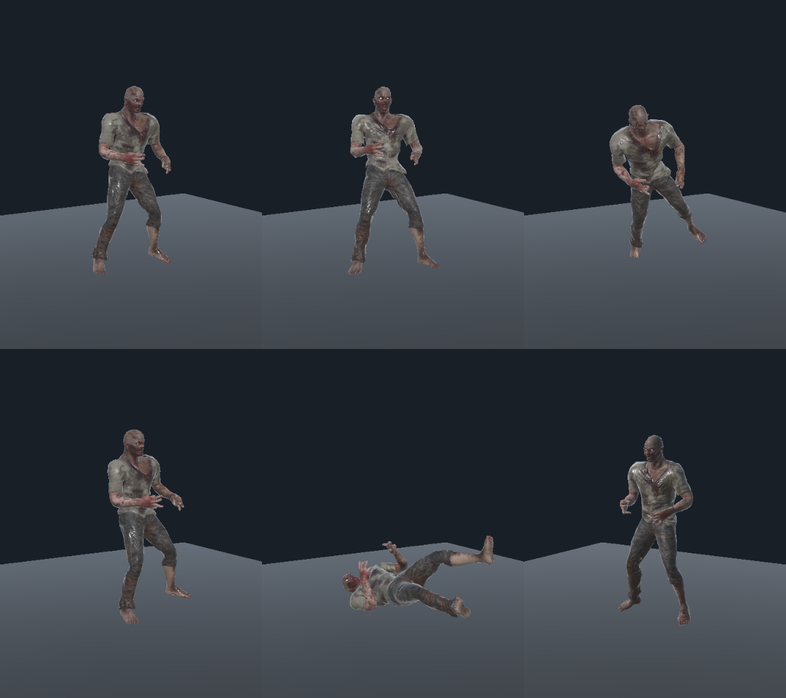

# ZombieRig import validation — 2026-09-21

Blender editing is not required for this asset. The earlier conclusion that the FBX must be normalized in Blender was too strong: rebuilding Unity's stale Avatar skeleton configuration fixes the scale problem without changing the FBX geometry, skin weights, or bone hierarchy.

## Cause and repair

- Imported model's bind-pose hip height: approximately 0.92 m.
- Old Humanoid Avatar `humanScale`: 105.4752. Evaluating Idle moved the hip to approximately 92 m and enlarged the rendered body.
- Cleared `ModelImporter.humanDescription.skeleton`, preserving the human-bone mapping, then reimported. Unity regenerated the skeleton in the correct imported units.
- Rebuilt Avatar `humanScale`: 1.054752. Idle hip height remains approximately 0.92 m.
- Source FBX SHA-256 before and after: `7AD977D8B372AD2F864910591033A04EDC6A5051B11ED5005A52640ABDD2E74F`.

The remaining armature object scale is not, by itself, evidence that the rig is unusable. The rebuilt Avatar and evaluated skinned geometry are the relevant checks.

## Gameplay integration

- Prefab: `Assets/FPS/Features/Characters/Content/Enemies/ZombieRig/Prefabs/ZombieRig.prefab`.
- Reuses the existing Humanoid controller, AI, health, NavMesh movement, NGO transform synchronization, and damage/lag-compensation components.
- Five hitbox segments, adjusted for this skeleton; six renderers with supported Standard materials.
- Registered in GameScene's ZombieRegistry and DefaultNetworkPrefabs. The registry now has five entries, including the two Male variants.

## Animation contact correction

Individual clips passed, but the original walk/run blend briefly sank approximately 6.2 cm at Speed 3. Enabled native Foot IK on the shared Humanoid controller's Locomotion state and recalibrated Run's import `heightOffset` from -0.130 to -0.085. Root Y remains baked into the pose, with feet-based height and original Y disabled.

Measured ZombieRig locomotion minimum mesh Y after correction: approximately +0.0116 m at Speed 3 and -0.0013 m at Speed 5; root Y stays at zero. Higher values during running include the airborne part of the stride. Attack and Death retain small retargeting contact differences of up to approximately 3 cm; this is separate from the previous whole-body scale/root-height failure. Foot IK here uses animation data, not terrain raycasts.

## Repeatable verification

Run `FPS.Tests.ZombieRigImportTests` in Unity's EditMode Test Runner. Final result: **3/3 passed**. It covers ZombieRig and both Male prefabs: five clips at 21 times each, plus seven locomotion speeds sampled over three seconds each. Assertions check Avatar scale, baked geometry size, ground-height tolerance, and stable root Y. Saved registration was also checked: one ZombieRig registry entry, one NGO entry, and no duplicate network prefab hashes. This is Editor animation and asset validation, not an end-to-end multiplayer match test.

Preview layout: Idle / Walk / Run; Attack / Death / alternate Idle view.

