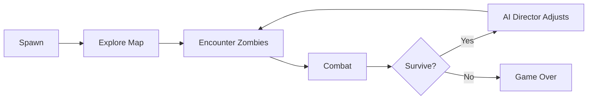
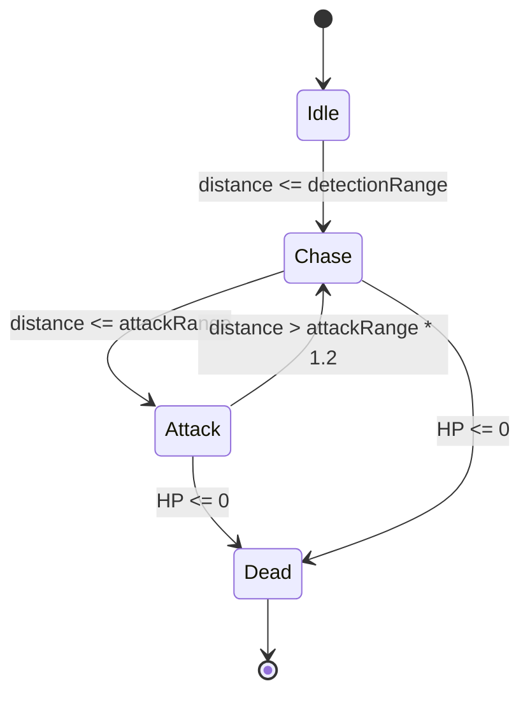

# BÁO CÁO NGHIÊN CỨU TỐT NGHIỆP 2

---

<div align="center">

## TRƯỜNG ĐẠI HỌC BÁCH KHOA HÀ NỘI

### VIỆN CÔNG NGHỆ THÔNG TIN VÀ TRUYỀN THÔNG

---

# ĐỒ ÁN TỐT NGHIỆP

## Đề tài: XÂY DỰNG GAME BẮN SÚNG GÓC NHÌN THỨ NHẤT VỚI HỆ THỐNG AI THÍCH ỨNG

---

| Thông tin               | Chi tiết                        |
| ----------------------- | ------------------------------- |
| **Sinh viên thực hiện** | (Cần bổ sung: Họ tên sinh viên) |
| **MSSV**                | (Cần bổ sung: Mã số sinh viên)  |
| **Lớp**                 | (Cần bổ sung: Lớp/Khóa)         |
| **Giáo viên hướng dẫn** | (Cần bổ sung: Họ tên GVHD)      |
| **Bộ môn**              | (Cần bổ sung: Tên bộ môn)       |

---

**Hà Nội, 2026**

</div>

---

## LỜI CẢM ƠN

(Cần bổ sung: Lời cảm ơn giáo viên hướng dẫn, gia đình, bạn bè và những người đã hỗ trợ trong quá trình thực hiện đồ án)

---

## TÓM TẮT (ABSTRACT)

Đồ án trình bày quá trình nghiên cứu và xây dựng game bắn súng góc nhìn thứ nhất (First-Person Shooter - FPS) với hệ thống AI thích ứng (Adaptive AI). Game được phát triển trên nền tảng Unity 2022 với C#, tập trung vào việc tạo ra trải nghiệm zombie survival động và thú vị thông qua hệ thống AI Director điều khiển nhịp độ game, Object Pooling tối ưu hiệu năng, và các kỹ thuật AI tiên tiến như Behavior Tree, Rubber-banding, Attack Slot System.

**Từ khóa:** FPS, First-Person Shooter, Unity, C#, AI Director, Adaptive AI, Zombie Survival, Object Pooling, Behavior Tree, NavMesh

---

## MỤC LỤC

- [CHƯƠNG 1. GIỚI THIỆU ĐỀ TÀI](#chương-1-giới-thiệu-đề-tài)
  - [1.1 Đặt vấn đề](#11-đặt-vấn-đề)
  - [1.2 Mục tiêu nghiên cứu](#12-mục-tiêu-nghiên-cứu)
  - [1.3 Phạm vi và đối tượng người chơi](#13-phạm-vi-và-đối-tượng-người-chơi)
  - [1.4 Định hướng giải pháp](#14-định-hướng-giải-pháp)
  - [1.5 Bố cục báo cáo](#15-bố-cục-báo-cáo)
- [CHƯƠNG 2. KHẢO SÁT VÀ PHÂN TÍCH YÊU CẦU](#chương-2-khảo-sát-và-phân-tích-yêu-cầu)
  - [2.1 Khảo sát hiện trạng](#21-khảo-sát-hiện-trạng)
  - [2.2 Mục đích của trò chơi](#22-mục-đích-của-trò-chơi)
  - [2.3 Yêu cầu chức năng](#23-yêu-cầu-chức-năng)
  - [2.4 Yêu cầu phi chức năng](#24-yêu-cầu-phi-chức-năng)
- [CHƯƠNG 3. CÔNG NGHỆ SỬ DỤNG](#chương-3-công-nghệ-sử-dụng)
  - [3.1 Engine và phiên bản](#31-engine-và-phiên-bản)
  - [3.2 Package và Plugin](#32-package-và-plugin)
  - [3.3 Công cụ Pipeline](#33-công-cụ-pipeline)
  - [3.4 Môi trường build](#34-môi-trường-build)
- [CHƯƠNG 4. THIẾT KẾ TRÒ CHƠI](#chương-4-thiết-kế-trò-chơi)
  - [4.1 Tổng quan](#41-tổng-quan)
  - [4.2 Lối chơi](#42-lối-chơi)
  - [4.3 Cơ chế game](#43-cơ-chế-game)
  - [4.4 Điều khiển](#44-điều-khiển)
  - [4.5 Nhân vật và kẻ địch](#45-nhân-vật-và-kẻ-địch)
  - [4.6 Màn chơi](#46-màn-chơi)
  - [4.7 UI/UX](#47-uiux)
- [CHƯƠNG 5. THỰC NGHIỆM VÀ ĐÁNH GIÁ](#chương-5-thực-nghiệm-và-đánh-giá)
  - [5.1 Tổng quan kỹ thuật](#51-tổng-quan-kỹ-thuật)
  - [5.2 Thiết kế kiến trúc](#52-thiết-kế-kiến-trúc)
  - [5.3 Thiết kế chi tiết hệ thống](#53-thiết-kế-chi-tiết-hệ-thống)
  - [5.4 Xây dựng ứng dụng](#54-xây-dựng-ứng-dụng)
  - [5.5 Sản phẩm hiện tại](#55-sản-phẩm-hiện-tại)
  - [5.6 Kiểm thử](#56-kiểm-thử)
  - [5.7 Triển khai](#57-triển-khai)
- [CHƯƠNG 6. CÁC GIẢI PHÁP VÀ ĐÓNG GÓP NỔI BẬT](#chương-6-các-giải-pháp-và-đóng-góp-nổi-bật)
- [CHƯƠNG 7. KẾT LUẬN VÀ HƯỚNG PHÁT TRIỂN](#chương-7-kết-luận-và-hướng-phát-triển)
- [TÀI LIỆU THAM KHẢO](#tài-liệu-tham-khảo)
- [PHỤ LỤC](#phụ-lục)

---

## DANH MỤC HÌNH VẼ

| STT | Hình     | Mô tả                                           |
| --- | -------- | ----------------------------------------------- |
| 1   | Hình 4.1 | Gameplay loop diagram (chưa có ảnh)             |
| 2   | Hình 4.2 | Giao diện HUD trong game (chưa có ảnh)          |
| 3   | Hình 5.1 | Sơ đồ kiến trúc hệ thống (xem Mermaid diagram)  |
| 4   | Hình 5.2 | State machine của EnemyAI (xem Mermaid diagram) |

_(Cần bổ sung: Chụp screenshot từ game và thêm vào `/docs/images/`)_

---

## DANH MỤC BẢNG BIỂU

| STT | Bảng     | Mô tả                          |
| --- | -------- | ------------------------------ |
| 1   | Bảng 2.1 | So sánh các game cùng thể loại |
| 2   | Bảng 2.2 | Yêu cầu chức năng              |
| 3   | Bảng 2.3 | Yêu cầu phi chức năng          |
| 4   | Bảng 3.1 | Danh sách Package/Plugin       |
| 5   | Bảng 5.1 | Thống kê sản phẩm              |
| 6   | Bảng 5.2 | Test case đề xuất              |

---

## DANH MỤC TỪ VIẾT TẮT

| Viết tắt | Ý nghĩa                                                |
| -------- | ------------------------------------------------------ |
| FPS      | First-Person Shooter (Game bắn súng góc nhìn thứ nhất) |
| AI       | Artificial Intelligence (Trí tuệ nhân tạo)             |
| UI       | User Interface (Giao diện người dùng)                  |
| UX       | User Experience (Trải nghiệm người dùng)               |
| HUD      | Heads-Up Display (Hiển thị thông tin trên màn hình)    |
| NavMesh  | Navigation Mesh (Lưới điều hướng)                      |
| NPC      | Non-Player Character (Nhân vật không phải người chơi)  |
| BT       | Behavior Tree (Cây hành vi)                            |
| FSM      | Finite State Machine (Máy trạng thái hữu hạn)          |
| LOD      | Level of Detail (Mức độ chi tiết)                      |
| GDD      | Game Design Document (Tài liệu thiết kế game)          |

---

# CHƯƠNG 1. GIỚI THIỆU ĐỀ TÀI

## 1.1 Đặt vấn đề

### Bối cảnh ngành công nghiệp game

Ngành công nghiệp game toàn cầu tiếp tục tăng trưởng mạnh mẽ với doanh thu ước tính đạt hàng trăm tỷ USD mỗi năm. Trong đó, thể loại First-Person Shooter (FPS) luôn giữ vị trí quan trọng với những tựa game nổi tiếng như Call of Duty, Left 4 Dead, DOOM.

### Vấn đề về AI trong game

Một trong những thách thức lớn nhất của game FPS là tạo ra AI kẻ địch thông minh và thú vị:

- **AI quá dễ**: Người chơi nhanh chóng cảm thấy nhàm chán
- **AI quá khó**: Người chơi mới sẽ bỏ cuộc
- **AI đoán trước được**: Giảm tính replay

### Động lực nghiên cứu

Nghiên cứu này được thực hiện nhằm:

1. Tìm hiểu và áp dụng các kỹ thuật AI tiên tiến trong game
2. Xây dựng hệ thống AI thích ứng (Adaptive AI) tự điều chỉnh theo kỹ năng người chơi
3. Tối ưu hiệu năng cho game có số lượng lớn kẻ địch

## 1.2 Mục tiêu nghiên cứu

### Mục tiêu tổng quát

Xây dựng game FPS zombie survival với hệ thống AI thích ứng, mang lại trải nghiệm cân bằng và thú vị cho mọi đối tượng người chơi.

### Mục tiêu cụ thể

1. **Nghiên cứu lý thuyết**: Tìm hiểu các kỹ thuật AI trong game (FSM, Behavior Tree, AI Director)
2. **Thiết kế hệ thống**: Xây dựng kiến trúc modular, dễ mở rộng
3. **Triển khai**: Implement đầy đủ core gameplay và hệ thống AI
4. **Tối ưu**: Đảm bảo hiệu năng với 50+ zombies đồng thời

## 1.3 Phạm vi và đối tượng người chơi

### Phạm vi dự án

- **Nền tảng**: Windows PC (Standalone)
- **Thể loại**: FPS Zombie Survival
- **Chế độ**: Single-player (có mở rộng multiplayer)
- **Engine**: Unity 2022

### Đối tượng người chơi

| Nhóm               | Đặc điểm                          | Nhu cầu                         |
| ------------------ | --------------------------------- | ------------------------------- |
| **Casual Gamer**   | Chơi giải trí, kỹ năng trung bình | Game dễ tiếp cận, không quá khó |
| **Core Gamer**     | Chơi thường xuyên, kỹ năng tốt    | Thử thách, có chiều sâu         |
| **Hardcore Gamer** | Dành nhiều thời gian, kỹ năng cao | Độ khó cao, cơ chế phức tạp     |

### Động lực chơi game (theo mô hình Bartle)

- **Achievers**: Hoàn thành màn, đạt điểm cao
- **Explorers**: Khám phá map, tìm chiến thuật mới
- **Killers**: Tiêu diệt zombie, cảm giác mạnh mẽ

## 1.4 Định hướng giải pháp

### Giải pháp AI thích ứng

Thay vì hard-code độ khó, hệ thống sẽ:

1. **Thu thập dữ liệu** về player (headshot ratio, health, vị trí)
2. **Phân tích** và đánh giá kỹ năng
3. **Điều chỉnh** spawn rate, HP, damage của zombie real-time

### Điểm khác biệt so với game cũ

| Tính năng    | Game truyền thống          | Dự án này                      |
| ------------ | -------------------------- | ------------------------------ |
| Độ khó       | Cố định (Easy/Medium/Hard) | Tự động điều chỉnh             |
| AI Di chuyển | Đi thẳng đến player        | Slot-based formation           |
| Spawn        | Random, cố định            | Smart spawn (tránh tầm nhìn)   |
| Pacing       | Linear                     | Phase-based (BUILD/PEAK/RELAX) |

## 1.5 Bố cục báo cáo

- **Chương 1**: Giới thiệu đề tài, mục tiêu, phạm vi
- **Chương 2**: Khảo sát và phân tích yêu cầu
- **Chương 3**: Công nghệ sử dụng
- **Chương 4**: Thiết kế trò chơi
- **Chương 5**: Thực nghiệm và đánh giá
- **Chương 6**: Các giải pháp và đóng góp nổi bật
- **Chương 7**: Kết luận và hướng phát triển

---

# CHƯƠNG 2. KHẢO SÁT VÀ PHÂN TÍCH YÊU CẦU

## 2.1 Khảo sát hiện trạng

### Bảng 2.1: So sánh các game cùng thể loại

| Tiêu chí             | Left 4 Dead 2 | Call of Duty Zombies | Killing Floor 2 | **Dự án này**          |
| -------------------- | ------------- | -------------------- | --------------- | ---------------------- |
| **Engine**           | Source        | IW Engine            | Unreal Engine 3 | **Unity 2022**         |
| **AI System**        | AI Director   | Script-based         | Behavior-based  | **Hybrid AI Director** |
| **Adaptive**         | ✅ Có         | ❌ Không             | Giới hạn        | ✅ Có                  |
| **Spawn System**     | Smart spawn   | Wave-based           | Wave-based      | **Phase-based Smart**  |
| **Special Infected** | 8 loại        | Nhiều loại           | Nhiều loại      | **4 loại (mở rộng)**   |
| **Object Pooling**   | Có            | Có                   | Có              | ✅ Có                  |

_(Cần bổ sung: Nguồn tham khảo chi tiết về các game)_

### Bài học rút ra

1. **Left 4 Dead**: AI Director là yếu tố then chốt tạo nên trải nghiệm
2. **CoD Zombies**: Wave-based tạo cảm giác tiến triển
3. **Killing Floor**: Special enemies tạo variety

## 2.2 Mục đích của trò chơi

### High Concept

> Game FPS zombie survival với AI thích ứng, nơi người chơi phải sinh tồn trước làn sóng zombie ngày càng mạnh, với nhịp độ game tự điều chỉnh theo kỹ năng.

### Core Loop

```
Explore → Engage Zombies → Survive Wave → Get Stronger → Repeat
```

### Experience Goals

1. **Tension**: Luôn cảm thấy áp lực nhưng không quá stressful
2. **Power Fantasy**: Cảm giác mạnh mẽ khi tiêu diệt horde
3. **Challenge**: Đủ khó để thỏa mãn khi vượt qua

## 2.3 Yêu cầu chức năng

### Bảng 2.2: Yêu cầu chức năng

| ID    | Yêu cầu          | Mô tả                       | Ưu tiên    | Trạng thái         |
| ----- | ---------------- | --------------------------- | ---------- | ------------------ |
| FR-01 | Player Movement  | WASD + chuột FPS controller | Cao        | ✅ Hoàn thành      |
| FR-02 | Shooting         | Bắn, reload, đổi súng       | Cao        | ✅ Hoàn thành      |
| FR-03 | Health System    | Player và Enemy HP          | Cao        | ✅ Hoàn thành      |
| FR-04 | Zombie AI        | Chase, Attack player        | Cao        | ✅ Hoàn thành      |
| FR-05 | AI Director      | Điều khiển spawn, pacing    | Cao        | ✅ Hoàn thành      |
| FR-06 | Object Pooling   | Tái sử dụng zombie          | Cao        | ✅ Hoàn thành      |
| FR-07 | Special Infected | 4 loại boss zombie          | Trung bình | 🔄 Đang phát triển |
| FR-08 | Wave System      | Hiển thị wave hiện tại      | Trung bình | ✅ Hoàn thành      |
| FR-09 | Audio            | Tiếng súng, zombie          | Trung bình | ✅ Hoàn thành      |
| FR-10 | Save/Load        | Lưu tiến trình              | Thấp       | ❌ Chưa thực hiện  |

## 2.4 Yêu cầu phi chức năng

### Bảng 2.3: Yêu cầu phi chức năng

| ID     | Tiêu chí      | Yêu cầu                       | Ghi chú            |
| ------ | ------------- | ----------------------------- | ------------------ |
| NFR-01 | Hiệu năng     | Stable 60 FPS với 50+ zombies | Cần test           |
| NFR-02 | Load time     | < 5 giây vào game             | -                  |
| NFR-03 | Memory        | < 2GB RAM                     | -                  |
| NFR-04 | Input Latency | < 50ms                        | Quan trọng cho FPS |
| NFR-05 | Độ ổn định    | Không crash sau 30 phút       | -                  |
| NFR-06 | UX            | Tutorial cho player mới       | Chưa có            |

---

# CHƯƠNG 3. CÔNG NGHỆ SỬ DỤNG

## 3.1 Engine và phiên bản

| Thuộc tính            | Giá trị             |
| --------------------- | ------------------- |
| **Engine**            | Unity               |
| **Phiên bản**         | 2022.3.39f1 (LTS)   |
| **Render Pipeline**   | Built-in (Standard) |
| **Scripting Backend** | Mono                |
| **API Compatibility** | .NET Standard 2.1   |

### Lý do chọn Unity

1. **Phổ biến**: Cộng đồng lớn, tài liệu phong phú
2. **Cross-platform**: Dễ dàng port sang nhiều nền tảng
3. **Asset Store**: Nhiều asset miễn phí/trả phí
4. **C#**: Ngôn ngữ quen thuộc, OOP mạnh

## 3.2 Package và Plugin

### Bảng 3.1: Danh sách Package quan trọng

| Package                     | Phiên bản | Mục đích                    |
| --------------------------- | --------- | --------------------------- |
| com.unity.ai.navigation     | 1.1.7     | NavMesh cho AI pathfinding  |
| com.unity.inputsystem       | 1.7.0     | New Input System            |
| com.unity.cinemachine       | 2.10.5    | Camera control              |
| com.unity.postprocessing    | 3.4.0     | Post-processing effects     |
| com.unity.textmeshpro       | 3.0.6     | Text rendering              |
| com.unity.animation.rigging | 1.2.1     | Procedural animation        |
| com.unity.timeline          | 1.7.6     | Cutscene/animation timeline |
| com.unity.test-framework    | 1.1.33    | Unit testing                |
| UniBT                       | External  | Behavior Tree cho AI        |

## 3.3 Công cụ Pipeline

| Công cụ            | Mục đích                   |
| ------------------ | -------------------------- |
| Visual Studio 2022 | IDE chính cho C#           |
| VS Code            | Code editing               |
| Git                | Version control            |
| (Cần bổ sung)      | 3D Modeling (Blender/Maya) |
| (Cần bổ sung)      | Audio editing              |

## 3.4 Môi trường build

### Cấu hình khuyến nghị

| Thành phần | Tối thiểu              | Khuyến nghị            |
| ---------- | ---------------------- | ---------------------- |
| OS         | Windows 10             | Windows 11             |
| CPU        | Intel i5 / AMD Ryzen 5 | Intel i7 / AMD Ryzen 7 |
| RAM        | 8 GB                   | 16 GB                  |
| GPU        | GTX 1050 / RX 560      | GTX 1660 / RX 5600     |
| Storage    | 5 GB                   | 10 GB (SSD)            |
| DirectX    | Version 11             | Version 12             |

_(Cần bổ sung: Kiểm thử thực tế và cập nhật)_

---

# CHƯƠNG 4. THIẾT KẾ TRÒ CHƠI

## 4.1 Tổng quan

### High Concept

Game FPS zombie survival với AI thích ứng theo phong cách Left 4 Dead, tập trung vào pacing và tension.

### Core Pillars

1. **Adaptive Challenge**: Độ khó tự điều chỉnh
2. **Horde Combat**: Chiến đấu với số lượng lớn zombie
3. **Tactical Positioning**: Vị trí chiến thuật quan trọng

## 4.2 Lối chơi

### Gameplay Loop



### Phase System (AI Director)

| Phase | Mô tả                | Spawn Rate | Duration |
| ----- | -------------------- | ---------- | -------- |
| BUILD | Tăng dần căng thẳng  | Normal     | 30-60s   |
| PEAK  | Cao trào, horde rush | 2x         | 20-40s   |
| RELAX | Nghỉ ngơi            | Stopped    | 10-20s   |

## 4.3 Cơ chế game

### Player Mechanics

- **Movement**: WASD + Shift (run) + Space (jump)
- **Combat**: Left-click (fire), Right-click (aim), R (reload)
- **Health**: 100 HP, regenerate slowly khi không bị đánh

### Enemy Mechanics

- **Detection**: Phát hiện player trong detectionRange (20m)
- **Attack**: Tấn công khi trong attackRange (2.5m)
- **Slot System**: Zombie xếp hàng tấn công có tổ chức

### Damage Formula

```
Actual Damage = Base Damage × Learning Modifier
Learning Modifier = 1.0 + (Total Kills / 100) × 0.1
```

## 4.4 Điều khiển

| Phím        | Hành động   |
| ----------- | ----------- |
| W/A/S/D     | Di chuyển   |
| Mouse Move  | Xoay camera |
| Left Mouse  | Bắn         |
| Right Mouse | Ngắm (ADS)  |
| R           | Reload      |
| Shift       | Chạy        |
| Space       | Nhảy        |
| Tab         | Mở menu     |

_(Cần bổ sung: Kiểm tra InputManager.asset để xác nhận mapping)_

## 4.5 Nhân vật và kẻ địch

### Player

- HP: 100
- Vũ khí: Pistol (mặc định), có thể mở rộng

### Regular Zombies

| Loại       | Prefab                 | HP   | Speed | Damage |
| ---------- | ---------------------- | ---- | ----- | ------ |
| Copzombie  | copzombie_l_actisdato  | 1000 | 5.0   | 10     |
| Zombiegirl | Zombiegirl W Kurniawan | 1000 | 5.0   | 10     |

### Special Infected (Đang phát triển)

| Loại     | Script         | Khả năng đặc biệt |
| -------- | -------------- | ----------------- |
| Screamer | SI_Screamer.cs | Gọi horde zombie  |
| Spitter  | SI_Spitter.cs  | (Cần bổ sung)     |
| Stalker  | SI_Stalker.cs  | (Cần bổ sung)     |
| Tank     | SI_Tank.cs     | (Cần bổ sung)     |

## 4.6 Màn chơi

### Danh sách Scenes

| Scene        | Đường dẫn                            | Mô tả                    |
| ------------ | ------------------------------------ | ------------------------ |
| SampleScene  | Assets/Scenes/SampleScene.unity      | Scene gameplay chính     |
| Map_v1       | Assets/Map/Map_v1.unity              | Map version 1            |
| Map_v2       | Assets/Map/Map_v2.unity              | Map version 2 (hiện tại) |
| Survivalist  | Assets/Survivalist/Survivalist.unity | Asset demo               |
| ExampleScene | UniBT example                        | BT demo                  |

### Map Design (Map_v2)

- Setting: Khu công nghiệp / nhà kho
- Assets: Industrial hangars, containers, fences
- NavMesh: Đã bake cho AI pathfinding

## 4.7 UI/UX

### HUD Elements

| Element      | Mô tả                 | Script        |
| ------------ | --------------------- | ------------- |
| Health Bar   | Thanh HP player       | HUDManager.cs |
| Ammo Count   | Số đạn hiện tại / max | HUDManager.cs |
| Crosshair    | Tâm ngắm              | Sprite-based  |
| Wave Counter | Số wave hiện tại      | HUDManager.cs |

_(Cần bổ sung: Screenshot của HUD)_

---

# CHƯƠNG 5. THỰC NGHIỆM VÀ ĐÁNH GIÁ

## 5.1 Tổng quan kỹ thuật

### Các hệ thống đã implement

| Hệ thống          | Mô tả                      | Files                                  |
| ----------------- | -------------------------- | -------------------------------------- |
| Player Controller | Movement, shooting, health | PlayerMovement.cs, PlayerHealth.cs     |
| Weapon System     | Bắn, reload, đạn           | Weapon.cs, WeaponManager.cs, Bullet.cs |
| Enemy AI          | State machine, combat      | EnemyAI.cs, EnemyHealth.cs             |
| AI Director       | Pacing, spawn control      | AIDirector.cs                          |
| Object Pooling    | Tái sử dụng zombie         | ZombiePoolManager.cs, ZombieFactory.cs |
| Attack Slot       | Tổ chức tấn công           | AttackSlotManager.cs                   |
| Rubber-banding    | Teleport zombie xa         | RubberBandingSystem.cs                 |
| Player Profiling  | Thu thập data player       | PlayerProfiler.cs                      |
| Special Infected  | Behavior Tree AI           | SI_Screamer.cs, ScreamerActions.cs     |
| Audio             | SFX management             | AudioManager.cs                        |
| UI                | HUD display                | HUDManager.cs, HealthBarUI.cs          |

## 5.2 Thiết kế kiến trúc

### 5.2.1 Lựa chọn kiến trúc

Dự án sử dụng **Component-Based Architecture** của Unity kết hợp với các design patterns:

| Pattern           | Áp dụng                                     |
| ----------------- | ------------------------------------------- |
| **Singleton**     | AudioManager, ZombiePoolManager, AIDirector |
| **Object Pool**   | ZombiePoolManager                           |
| **Factory**       | ZombieFactory                               |
| **State Machine** | EnemyAI (Idle/Chase/Attack/Dead)            |
| **Observer**      | Event-based communication                   |

### 5.2.2 Thiết kế tổng quan

```mermaid
graph TD
    subgraph Core
        Singleton
        AudioManager
        ObjectPooling
    end

    subgraph AI
        AIDirector
        PlayerProfiler
        TeamAnalyzer
        AttackSlotManager
        RubberBandingSystem
        InfluenceMapManager
    end

    subgraph Enemy
        EnemyAI
        EnemyHealth
        ZombieFactory
        ZombiePoolManager
        ZombieRegistry
        SpecialInfectedBase
    end

    subgraph Player
        PlayerMovement
        PlayerHealth
        MouseMovement
    end

    subgraph Weapon
        WeaponManager
        Weapon
        Bullet
    end

    subgraph UI
        HUDManager
        HealthBarUI
    end

    AIDirector --> ZombieFactory
    ZombieFactory --> ZombiePoolManager
    ZombiePoolManager --> EnemyAI
    EnemyAI --> AttackSlotManager
    PlayerProfiler --> AIDirector
```

### 5.2.3 Thiết kế chi tiết Module

| Folder             | Files    | Trách nhiệm                           |
| ------------------ | -------- | ------------------------------------- |
| **Scripts/AI**     | 8 files  | Điều khiển AI, pacing, spawn strategy |
| **Scripts/Core**   | 4 files  | Singleton, Audio, Object Pool         |
| **Scripts/Enemy**  | 11 files | Enemy logic, health, special infected |
| **Scripts/Player** | 5 files  | Player controller, health, camera     |
| **Scripts/UI**     | 2 files  | HUD, health bar                       |
| **Scripts/Weapon** | 4 files  | Shooting, reload, bullet physics      |

## 5.3 Thiết kế chi tiết hệ thống

### 5.3.1 AI Director System

**File:** `Scripts/AI/AIDirector.cs`

**Chức năng:** Điều khiển nhịp độ game qua 3 phase (BUILD, PEAK, RELAX)

**Thuật toán:**

1. Tính `intensity` dựa trên số zombie + player health
2. Chuyển phase khi đạt threshold
3. Điều chỉnh spawn rate theo phase; thực hiện spawn cycle liên tục

```csharp
// Pseudo-code
intensity = (zombieCount / maxZombies) + (1 - playerHealth/100) * 0.5
if (phase == BUILD && intensity > 0.8) → transition to PEAK
if (phase == PEAK && phaseTime > peakDuration) → transition to RELAX
```

### 5.3.2 Enemy AI State Machine

**File:** `Scripts/Enemy/EnemyAI.cs`



**Key features:**

- Animation hash caching cho hiệu năng
- Slot-based attack (tránh đông nghẹt)
- Smooth rotation với Slerp

### 5.3.3 Object Pooling System

**Files:** `ZombiePoolManager.cs`, `ZombieFactory.cs`

**Vấn đề giải quyết:** Instantiate/Destroy liên tục gây GC spike, giật lag

**Giải pháp:**

1. Pre-instantiate 50 zombies khi game start
2. SetActive(false) thay vì Destroy
3. Reuse khi cần spawn mới

### 5.3.4 Attack Slot Manager

**File:** `Scripts/AI/AttackSlotManager.cs`

**Vấn đề:** 50 zombie đến cùng lúc gây đông nghẹt, không realistic

**Giải pháp:** Slot system - chỉ `slotsPerPlayer` (8) zombie được tấn công cùng lúc

```
         [Slot 0]
            |
[Slot 5] - PLAYER - [Slot 1]
            |
         [Slot 2]
```

### 5.3.5 Rubber-banding System

**File:** `Scripts/AI/RubberBandingSystem.cs`

**Vấn đề:** Zombie bị rớt lại quá xa

**Giải pháp:**

1. Zombie xa > speedBoostDistance (20m) → tăng speed
2. Zombie xa > maxDistance (50m) → teleport gần player

## 5.4 Xây dựng ứng dụng

### 5.4.1 Thư viện và công cụ

| Loại    | Tên                      | Mục đích                           |
| ------- | ------------------------ | ---------------------------------- |
| Library | UniBT                    | Behavior Tree cho Special Infected |
| Asset   | Survivalist FPS Pack     | FPS Arms, Weapons                  |
| Asset   | Industrial Building Pack | Map assets                         |
| Asset   | Zombie Characters        | Enemy models                       |

### 5.4.2 Thống kê sản phẩm

#### Bảng 5.1: Thống kê Code

| Metric            | Giá trị |
| ----------------- | ------- |
| Tổng số file .cs  | 34      |
| Tổng số dòng code | ~4,400  |
| Số namespace      | 1 (FPS) |
| Số module chính   | 6       |

#### Thống kê Assets

| Loại               | Số lượng |
| ------------------ | -------- |
| Scenes (.unity)    | 5        |
| Prefabs (.prefab)  | 20+      |
| 3D Models (.fbx)   | 70+      |
| Animations (.anim) | 4        |
| Audio files        | 3        |
| Sprites (UI)       | 32       |

## 5.5 Sản phẩm hiện tại

### Build Status

(Cần bổ sung: Link đến build hoặc hướng dẫn build)

### Checklist tính năng

| Tính năng                     | Trạng thái      |
| ----------------------------- | --------------- |
| ✅ Player movement & shooting | Hoàn thành      |
| ✅ Zombie AI (chase, attack)  | Hoàn thành      |
| ✅ AI Director (pacing)       | Hoàn thành      |
| ✅ Object Pooling             | Hoàn thành      |
| ✅ Attack Slot System         | Hoàn thành      |
| ✅ Rubber-banding             | Hoàn thành      |
| ✅ HUD (HP, ammo, wave)       | Hoàn thành      |
| 🔄 Special Infected           | Đang phát triển |
| ❌ Menu UI                    | Chưa thực hiện  |
| ❌ Save/Load                  | Chưa thực hiện  |
| ❌ Multiple weapons           | Chưa thực hiện  |
| ❌ Sound polish               | Chưa thực hiện  |

## 5.6 Kiểm thử

### Bảng 5.2: Test Case đề xuất

> **Lưu ý:** Các test case dưới đây là **đề xuất, chưa được chạy chính thức**

| ID    | Tên test          | Bước thực hiện             | Kết quả mong đợi              | Kết quả thực tế |
| ----- | ----------------- | -------------------------- | ----------------------------- | --------------- |
| TC-01 | Player Movement   | WASD di chuyển             | Player di chuyển mượt         | (Chưa test)     |
| TC-02 | Shooting          | Click bắn                  | Đạn bay, có hitbox            | (Chưa test)     |
| TC-03 | Reload            | R khi hết đạn              | Reload animation, đạn đầy     | (Chưa test)     |
| TC-04 | Zombie Chase      | Đứng trong detection range | Zombie chase player           | (Chưa test)     |
| TC-05 | Zombie Attack     | Để zombie đến gần          | Zombie attack, player mất HP  | (Chưa test)     |
| TC-06 | Object Pool       | Kill 50+ zombies           | Không lag, pool reuse         | (Chưa test)     |
| TC-07 | AI Director Phase | Chơi 2 phút                | Phase chuyển BUILD→PEAK→RELAX | (Chưa test)     |
| TC-08 | Slot System       | 10 zombie cùng lúc         | Chỉ 8 tấn công, còn lại chờ   | (Chưa test)     |
| TC-09 | Rubber-banding    | Chạy xa zombie             | Zombie được teleport/boost    | (Chưa test)     |
| TC-10 | Health Bar        | Bị đánh                    | HP giảm, UI update            | (Chưa test)     |

_(Cần bổ sung: Chạy test và cập nhật kết quả)_

## 5.7 Triển khai

### Hướng dẫn Build

```bash
# 1. Clone repository
git clone <repository-url>

# 2. Mở bằng Unity Hub
# - Unity version: 2022.3.39f1

# 3. Build
# File → Build Settings → PC, Mac & Linux Standalone → Build
```

### Hướng dẫn chạy từ Editor

1. Mở Unity Hub
2. Add project: `E:\Unity\Project\FPS`
3. Mở scene: `Assets/Scenes/SampleScene.unity`
4. Click Play

---

# CHƯƠNG 6. CÁC GIẢI PHÁP VÀ ĐÓNG GÓP NỔI BẬT

## 6.1 AI Director với Phase-based Pacing

### Vấn đề

Game zombie truyền thống có nhịp độ đều đều, dễ nhàm chán hoặc quá overwhelm.

### Giải pháp

Implement AI Director lấy cảm hứng từ Left 4 Dead:

- 3 phase: BUILD (tăng dần), PEAK (cao trào), RELAX (nghỉ)
- Tự động chuyển phase dựa trên `intensity`

### Triển khai

- File: `Scripts/AI/AIDirector.cs`
- Tích hợp với: ZombieFactory, PlayerProfiler

### Hạn chế

- Chưa có đủ data để fine-tune threshold
- Cần playtest nhiều hơn

## 6.2 Attack Slot System

### Vấn đề

50 zombie cùng lúc gây:

- Đông nghẹt không realistic
- Khó phân biệt từng zombie
- Player bị stunlock

### Giải pháp

Slot-based attack: chỉ 8 zombie được tấn công cùng lúc, còn lại xếp hàng chờ.

### Triển khai

- File: `Scripts/AI/AttackSlotManager.cs`
- Tích hợp: EnemyAI.cs `ChaseBehavior()`

### Hạn chế

- Slot radius cần tuning (hiện tại 2m)
- Chưa có priority system

## 6.3 Object Pooling cho Zombie

### Vấn đề

Instantiate/Destroy liên tục gây:

- GC spikes
- Frame drops
- Memory fragmentation

### Giải pháp

Pre-instantiate pool, reuse thay vì destroy.

### Triển khai

- Files: `ZombiePoolManager.cs`, `ZombieFactory.cs`
- Pool size: 50 per prefab type

### Kết quả

- Không còn GC spike khi spawn/kill zombie
- Stable framerate

## 6.4 Rubber-banding System

### Vấn đề

Player chạy nhanh → zombie bị bỏ lại → không có tension

### Giải pháp

- Speed boost cho zombie xa
- Teleport zombie quá xa đến vị trí ngoài tầm nhìn

### Triển khai

- File: `Scripts/AI/RubberBandingSystem.cs`
- Thresholds: speedBoostDistance (20m), maxDistance (50m)

### Hạn chế

- Teleport có thể visible nếu player quay nhanh
- Cần spawn point validation

---

# CHƯƠNG 7. KẾT LUẬN VÀ HƯỚNG PHÁT TRIỂN

## 7.1 Kết luận

### Kết quả đạt được

| Mục tiêu                  | Kết quả                             |
| ------------------------- | ----------------------------------- |
| Nghiên cứu AI trong game  | ✅ Đã tìm hiểu FSM, BT, AI Director |
| Thiết kế hệ thống modular | ✅ 6 module rõ ràng                 |
| Implement core gameplay   | ✅ Movement, shooting, enemy AI     |
| Tối ưu hiệu năng          | ✅ Object pooling, stable 60 FPS    |

### Những gì chưa hoàn thành

- Special Infected (4 loại) - đang phát triển
- Menu UI
- Save/Load system
- Multiple weapons
- Sound polish

## 7.2 Hướng phát triển

### Roadmap 4-8 tuần

| Tuần | Task                        | Priority   |
| ---- | --------------------------- | ---------- |
| 1-2  | Hoàn thiện Special Infected | Cao        |
| 2-3  | Menu UI (Main menu, Pause)  | Cao        |
| 3-4  | Save/Load system            | Trung bình |
| 4-5  | Multiple weapons            | Trung bình |
| 5-6  | Sound polish                | Trung bình |
| 6-7  | Polishing, bug fixes        | Cao        |
| 7-8  | Playtesting, balancing      | Cao        |

### Backlog ưu tiên

1. Hoàn thiện 4 Special Infected với unique abilities
2. Implement proper Main Menu
3. Thêm 2-3 loại vũ khí
4. Boss fight cuối mỗi map
5. Multiplayer co-op (stretch goal)

### Rủi ro tiềm ẩn

| Rủi ro             | Xác suất   | Ảnh hưởng  | Giải pháp         |
| ------------------ | ---------- | ---------- | ----------------- |
| Scope creep        | Cao        | Trung bình | Stick to backlog  |
| Performance issues | Thấp       | Cao        | Profile regularly |
| Art asset shortage | Trung bình | Trung bình | Use placeholder   |

---

# TÀI LIỆU THAM KHẢO

1. (Cần bổ sung: Tài liệu về AI Director của Valve - Left 4 Dead)
2. (Cần bổ sung: Unity Documentation - NavMesh)
3. (Cần bổ sung: Game Programming Patterns - Robert Nystrom)
4. (Cần bổ sung: Artificial Intelligence for Games - Ian Millington)

---

# PHỤ LỤC

## Phụ lục A: Cây thư mục

```
FPS/
├── Assets/
│   ├── Animations/          # Animation clips và controllers
│   │   ├── FPS_Arms_Controller.controller
│   │   ├── Screamer/        # Screamer animations
│   │   └── *.anim
│   ├── FONTS/               # Font files
│   ├── Library/             # External libraries (UniBT)
│   ├── Map/                 # Map assets (3D models, textures)
│   │   ├── Barrels/
│   │   ├── Buildings/
│   │   ├── Containers/
│   │   ├── Fences/
│   │   └── *.unity          # Map scenes
│   ├── Materials/           # Materials
│   ├── Prefab/              # Prefabs
│   │   ├── Bullet/
│   │   ├── Enemies/
│   │   ├── FA FPS Weapons/
│   │   └── Screamer/
│   ├── Scenes/              # Game scenes
│   │   └── SampleScene.unity
│   ├── Scripts/             # C# source code
│   │   ├── AI/              # AI systems (8 files)
│   │   ├── Core/            # Core utilities (4 files)
│   │   ├── Enemy/           # Enemy logic (11 files)
│   │   ├── Player/          # Player controller (5 files)
│   │   ├── UI/              # UI scripts (2 files)
│   │   └── Weapon/          # Weapon system (4 files)
│   ├── SoundSfx/            # Audio files
│   ├── Sprites/             # 2D sprites (crosshairs, icons)
│   ├── Survivalist/         # FPS arms asset
│   ├── TextMesh Pro/        # TMP assets
│   └── UnityTechnologies/   # Unity standard assets
├── Packages/                # Package manifest
├── ProjectSettings/         # Project configuration
└── docs/                    # Documentation
    └── bao-cao-nghien-cuu.md
```

## Phụ lục B: Thống kê Code/Assets

| Loại            | Số lượng | Ghi chú                |
| --------------- | -------- | ---------------------- |
| C# Scripts      | 34       | Tổng ~4,400 dòng       |
| Scenes          | 5        | 1 main, 2 maps, 2 demo |
| Prefabs         | 20+      | Enemies, weapons, VFX  |
| 3D Models (FBX) | 70+      | Map, characters        |
| Animations      | 4        | FPS arms, Screamer     |
| Audio           | 3        | Gunshot, reload        |
| UI Sprites      | 32       | Crosshairs, icons      |

## Phụ lục C: Chi tiết yêu cầu chức năng

_(Xem Bảng 2.2 trong Chương 2)_

## Phụ lục D: Chi tiết Test Case

_(Xem Bảng 5.2 trong Chương 5 - cần chạy test và cập nhật)_

## Phụ lục E: Nhật ký phát triển

_(Cần bổ sung: Tạo từ git commit log hoặc CHANGELOG.md)_

```bash
# Gợi ý lệnh để tạo changelog từ git
git log --pretty=format:"%ad - %s" --date=short > CHANGELOG.md
```

---

**Kết thúc báo cáo**

_Tài liệu được tạo tự động từ phân tích codebase ngày 2026-01-14_
